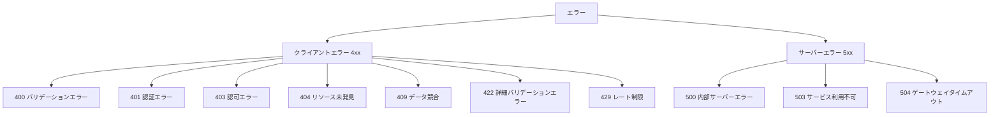

# エラーハンドリング設計書

## 1. 概要

### 目的
トランスクリプトから議事録作成APIシステムのエラーハンドリング方式を詳細に定義し、一貫性のあるエラー処理とユーザビリティの向上を実現する

### 対象範囲
- 全APIエンドポイントのエラーハンドリング
- HTTPステータスコードの統一
- エラーメッセージの標準化
- ログ出力とモニタリング

### 前提条件
- FastAPI の例外処理機能の使用
- HTTP標準ステータスコードの準拠
- JSON形式でのエラーレスポンス

## 2. 設計方針

### 基本方針
- **一貫性**: 統一されたエラーレスポンス形式
- **情報性**: 適切なエラー情報の提供
- **セキュリティ**: 機密情報の漏洩防止
- **運用性**: 効果的なログ出力とモニタリング

### 制約事項
- セキュリティ情報の漏洩防止
- パフォーマンスへの影響最小化
- 国際化対応の考慮

### 品質要件
- **可用性**: エラー発生時の適切な処理継続
- **保守性**: エラー原因の迅速な特定
- **ユーザビリティ**: 理解しやすいエラーメッセージ

## 3. エラー分類と対応

### 3.1 エラー分類体系



### 3.2 HTTPステータスコード対応表

| ステータスコード | 名称 | 用途 | 例 |
|-----------------|------|------|-----|
| 400 | Bad Request | 一般的なリクエストエラー | 必須パラメータ不足 |
| 401 | Unauthorized | 認証エラー | JWTトークン無効 |
| 403 | Forbidden | 認可エラー | リソースアクセス権限なし |
| 404 | Not Found | リソース未発見 | 指定された議事録が存在しない |
| 409 | Conflict | データ競合 | ユーザー名重複 |
| 422 | Unprocessable Entity | バリデーションエラー | 入力値形式エラー |
| 429 | Too Many Requests | レート制限 | API呼び出し制限超過 |
| 500 | Internal Server Error | サーバー内部エラー | 予期しないシステムエラー |
| 503 | Service Unavailable | サービス利用不可 | OpenAI API利用不可 |
| 504 | Gateway Timeout | ゲートウェイタイムアウト | OpenAI APIタイムアウト |

## 4. エラーレスポンス形式

### 4.1 標準エラーレスポンス

#### 基本形式
```json
{
  "detail": "エラーメッセージ",
  "error_code": "ERROR_CODE",
  "timestamp": "2025-06-23T07:30:00Z",
  "path": "/api/endpoint"
}
```

#### 実装例
```python
class StandardErrorResponse(BaseModel):
    detail: str = Field(..., description="エラーメッセージ")
    error_code: Optional[str] = Field(None, description="エラーコード")
    timestamp: Optional[str] = Field(None, description="エラー発生時刻")
    path: Optional[str] = Field(None, description="エラー発生エンドポイント")
```

### 4.2 バリデーションエラーレスポンス

#### 詳細形式
```json
{
  "detail": [
    {
      "loc": ["body", "username"],
      "msg": "ensure this value has at least 3 characters",
      "type": "value_error.any_str.min_length",
      "ctx": {"limit_value": 3}
    },
    {
      "loc": ["body", "email"],
      "msg": "field required",
      "type": "value_error.missing"
    }
  ],
  "error_code": "VALIDATION_ERROR",
  "timestamp": "2025-06-23T07:30:00Z"
}
```

#### 実装例
```python
class ValidationErrorDetail(BaseModel):
    loc: List[Union[str, int]] = Field(..., description="エラー発生箇所")
    msg: str = Field(..., description="エラーメッセージ")
    type: str = Field(..., description="エラータイプ")
    ctx: Optional[Dict[str, Any]] = Field(None, description="エラーコンテキスト")

class ValidationErrorResponse(BaseModel):
    detail: List[ValidationErrorDetail] = Field(..., description="バリデーションエラー詳細")
    error_code: str = Field("VALIDATION_ERROR", description="エラーコード")
    timestamp: Optional[str] = Field(None, description="エラー発生時刻")
```

## 5. エンドポイント別エラーハンドリング

### 5.1 認証系エンドポイント

#### POST /auth/register

##### エラーケースと対応
```python
@router.post("/register", response_model=UserResponse)
async def register_user(user: UserCreate, db: Session = Depends(get_db)):
    try:
        # ユーザー名重複チェック
        existing_user = get_user_by_username(db, user.username)
        if existing_user:
            logger.warning(f"Registration failed: username {user.username} already exists")
            raise HTTPException(
                status_code=status.HTTP_409_CONFLICT,
                detail="Username already registered",
                headers={"error_code": "USERNAME_CONFLICT"}
            )
        
        # メールアドレス重複チェック
        existing_email = get_user_by_email(db, user.email)
        if existing_email:
            logger.warning(f"Registration failed: email {user.email} already exists")
            raise HTTPException(
                status_code=status.HTTP_409_CONFLICT,
                detail="Email already registered",
                headers={"error_code": "EMAIL_CONFLICT"}
            )
        
        # ユーザー作成
        db_user = create_user(db, user.username, user.email, user.password)
        logger.info(f"User registered successfully: {user.username}")
        return UserResponse.from_orm(db_user)
        
    except HTTPException:
        raise
    except Exception as e:
        logger.error(f"User registration failed: {str(e)}", exc_info=True)
        raise HTTPException(
            status_code=status.HTTP_500_INTERNAL_SERVER_ERROR,
            detail="Failed to create user",
            headers={"error_code": "REGISTRATION_FAILED"}
        )
```

##### エラーレスポンス例
```json
// 409 Conflict - ユーザー名重複
{
  "detail": "Username already registered",
  "error_code": "USERNAME_CONFLICT",
  "timestamp": "2025-06-23T07:30:00Z",
  "path": "/auth/register"
}

// 422 Validation Error - 入力値エラー
{
  "detail": [
    {
      "loc": ["body", "username"],
      "msg": "ensure this value has at least 3 characters",
      "type": "value_error.any_str.min_length"
    }
  ],
  "error_code": "VALIDATION_ERROR"
}
```

#### POST /auth/login

##### エラーケースと対応
```python
@router.post("/login", response_model=Token)
async def login_user(user_credentials: UserLogin, db: Session = Depends(get_db)):
    try:
        # ユーザー認証
        user = authenticate_user(db, user_credentials.username, user_credentials.password)
        if not user:
            logger.warning(f"Login failed for username: {user_credentials.username}")
            raise HTTPException(
                status_code=status.HTTP_401_UNAUTHORIZED,
                detail="Incorrect username or password",
                headers={
                    "WWW-Authenticate": "Bearer",
                    "error_code": "AUTHENTICATION_FAILED"
                }
            )
        
        # JWT トークン生成
        access_token = create_access_token(data={"sub": user.username})
        logger.info(f"User logged in successfully: {user_credentials.username}")
        return {"access_token": access_token, "token_type": "bearer"}
        
    except HTTPException:
        raise
    except Exception as e:
        logger.error(f"Login process failed: {str(e)}", exc_info=True)
        raise HTTPException(
            status_code=status.HTTP_500_INTERNAL_SERVER_ERROR,
            detail="Login process failed",
            headers={"error_code": "LOGIN_PROCESS_FAILED"}
        )
```

### 5.2 議事録系エンドポイント

#### POST /minutes/generate

##### エラーケースと対応
```python
@router.post("/generate", response_model=MinutesResponse)
async def generate_minutes(
    minutes_data: MinutesGenerate,
    current_user: User = Depends(get_current_user),
    db: Session = Depends(get_db)
):
    try:
        logger.info(f"Generating minutes for user: {current_user.username}")
        
        # OpenAI API で議事録生成
        generated_content = await generate_meeting_minutes(
            minutes_data.transcript, 
            minutes_data.title
        )
        
        # データベースに保存
        db_minutes = Minutes(
            user_id=current_user.id,
            title=minutes_data.title,
            transcript=minutes_data.transcript,
            generated_minutes=generated_content
        )
        db.add(db_minutes)
        db.commit()
        db.refresh(db_minutes)
        
        logger.info(f"Minutes generated successfully for user: {current_user.username}")
        return MinutesResponse.from_orm(db_minutes)
        
    except OpenAIAPIError as e:
        logger.error(f"OpenAI API error: {str(e)}")
        if "quota" in str(e).lower():
            raise HTTPException(
                status_code=status.HTTP_503_SERVICE_UNAVAILABLE,
                detail="AI service temporarily unavailable due to quota limits",
                headers={"error_code": "OPENAI_QUOTA_EXCEEDED"}
            )
        elif "timeout" in str(e).lower():
            raise HTTPException(
                status_code=status.HTTP_504_GATEWAY_TIMEOUT,
                detail="AI service request timed out",
                headers={"error_code": "OPENAI_TIMEOUT"}
            )
        else:
            raise HTTPException(
                status_code=status.HTTP_503_SERVICE_UNAVAILABLE,
                detail="AI service temporarily unavailable",
                headers={"error_code": "OPENAI_SERVICE_ERROR"}
            )
    except DatabaseError as e:
        logger.error(f"Database error during minutes generation: {str(e)}")
        raise HTTPException(
            status_code=status.HTTP_500_INTERNAL_SERVER_ERROR,
            detail="Failed to save generated minutes",
            headers={"error_code": "DATABASE_SAVE_FAILED"}
        )
    except Exception as e:
        logger.error(f"Unexpected error during minutes generation: {str(e)}", exc_info=True)
        raise HTTPException(
            status_code=status.HTTP_500_INTERNAL_SERVER_ERROR,
            detail="Failed to generate meeting minutes",
            headers={"error_code": "MINUTES_GENERATION_FAILED"}
        )
```

##### エラーレスポンス例
```json
// 503 Service Unavailable - OpenAI API制限
{
  "detail": "AI service temporarily unavailable due to quota limits",
  "error_code": "OPENAI_QUOTA_EXCEEDED",
  "timestamp": "2025-06-23T07:30:00Z",
  "path": "/minutes/generate"
}

// 504 Gateway Timeout - OpenAI APIタイムアウト
{
  "detail": "AI service request timed out",
  "error_code": "OPENAI_TIMEOUT",
  "timestamp": "2025-06-23T07:30:00Z",
  "path": "/minutes/generate"
}
```

#### GET /minutes/{minutes_id}

##### エラーケースと対応
```python
@router.get("/{minutes_id}", response_model=MinutesResponse)
async def get_minutes_by_id(
    minutes_id: int,
    current_user: User = Depends(get_current_user),
    db: Session = Depends(get_db)
):
    try:
        # 議事録取得
        minutes = db.query(Minutes).filter(Minutes.id == minutes_id).first()
        if not minutes:
            logger.warning(f"Minutes {minutes_id} not found")
            raise HTTPException(
                status_code=status.HTTP_404_NOT_FOUND,
                detail="Minutes not found",
                headers={"error_code": "MINUTES_NOT_FOUND"}
            )
        
        # 所有者チェック
        if minutes.user_id != current_user.id:
            logger.warning(f"Access denied: user {current_user.username} tried to access minutes {minutes_id}")
            raise HTTPException(
                status_code=status.HTTP_403_FORBIDDEN,
                detail="Access denied: You can only access your own minutes",
                headers={"error_code": "ACCESS_DENIED"}
            )
        
        logger.info(f"Minutes {minutes_id} retrieved successfully")
        return MinutesResponse.from_orm(minutes)
        
    except HTTPException:
        raise
    except Exception as e:
        logger.error(f"Error retrieving minutes {minutes_id}: {str(e)}", exc_info=True)
        raise HTTPException(
            status_code=status.HTTP_500_INTERNAL_SERVER_ERROR,
            detail="Failed to retrieve minutes",
            headers={"error_code": "MINUTES_RETRIEVAL_FAILED"}
        )
```

## 6. 共通エラーハンドラー

### 6.1 グローバル例外ハンドラー

#### 実装例
```python
from fastapi import FastAPI, Request, HTTPException
from fastapi.responses import JSONResponse
from fastapi.exceptions import RequestValidationError
import traceback
from datetime import datetime

app = FastAPI()

@app.exception_handler(HTTPException)
async def http_exception_handler(request: Request, exc: HTTPException):
    error_response = {
        "detail": exc.detail,
        "timestamp": datetime.utcnow().isoformat() + "Z",
        "path": str(request.url.path)
    }
    
    # ヘッダーからエラーコードを取得
    if hasattr(exc, 'headers') and exc.headers and 'error_code' in exc.headers:
        error_response["error_code"] = exc.headers['error_code']
    
    return JSONResponse(
        status_code=exc.status_code,
        content=error_response
    )

@app.exception_handler(RequestValidationError)
async def validation_exception_handler(request: Request, exc: RequestValidationError):
    error_response = {
        "detail": exc.errors(),
        "error_code": "VALIDATION_ERROR",
        "timestamp": datetime.utcnow().isoformat() + "Z",
        "path": str(request.url.path)
    }
    
    return JSONResponse(
        status_code=422,
        content=error_response
    )

@app.exception_handler(Exception)
async def general_exception_handler(request: Request, exc: Exception):
    logger.error(f"Unhandled exception: {str(exc)}", exc_info=True)
    
    error_response = {
        "detail": "Internal server error",
        "error_code": "INTERNAL_SERVER_ERROR",
        "timestamp": datetime.utcnow().isoformat() + "Z",
        "path": str(request.url.path)
    }
    
    return JSONResponse(
        status_code=500,
        content=error_response
    )
```

### 6.2 認証エラーハンドラー

#### JWT認証エラー
```python
def get_current_user(
    credentials: HTTPAuthorizationCredentials = Depends(security),
    db: Session = Depends(get_db)
) -> User:
    credentials_exception = HTTPException(
        status_code=status.HTTP_401_UNAUTHORIZED,
        detail="Could not validate credentials",
        headers={
            "WWW-Authenticate": "Bearer",
            "error_code": "INVALID_CREDENTIALS"
        }
    )
    
    try:
        token_data = verify_token(credentials.credentials, credentials_exception)
        user = get_user_by_username(db, username=token_data.username)
        if user is None:
            logger.warning(f"User not found for token: {token_data.username}")
            raise credentials_exception
        return user
    except JWTError as e:
        logger.warning(f"JWT validation failed: {str(e)}")
        raise credentials_exception
    except Exception as e:
        logger.error(f"Authentication error: {str(e)}")
        raise HTTPException(
            status_code=status.HTTP_500_INTERNAL_SERVER_ERROR,
            detail="Authentication service error",
            headers={"error_code": "AUTH_SERVICE_ERROR"}
        )
```

---

**作成日**: 2025年6月23日  
**作成者**: Devin AI  
**バージョン**: 1.0  
**承認者**: 未承認
