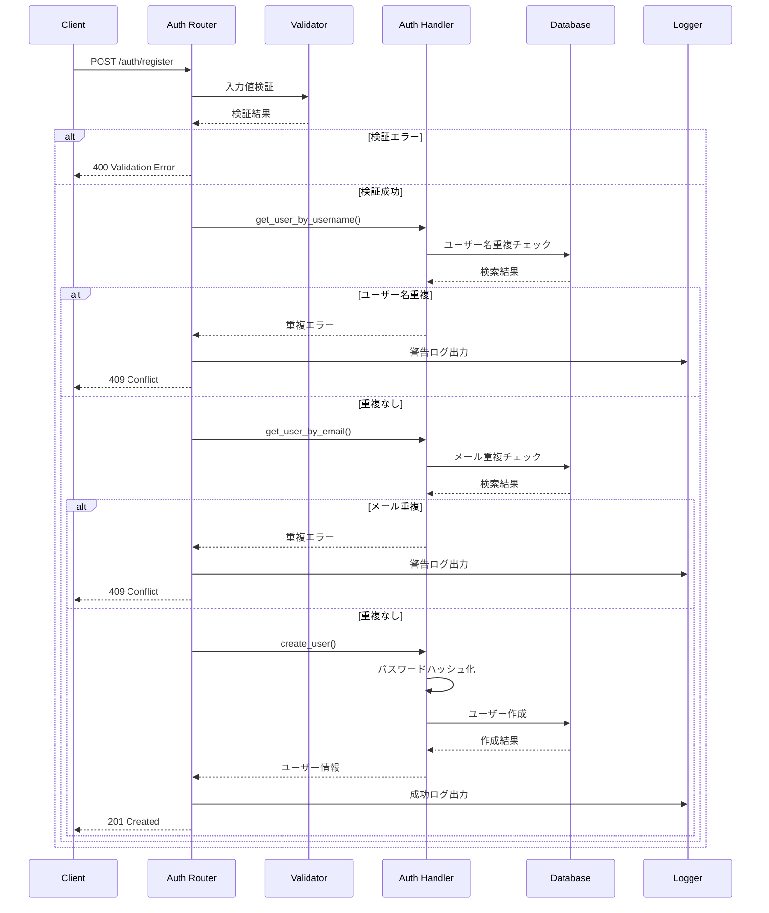
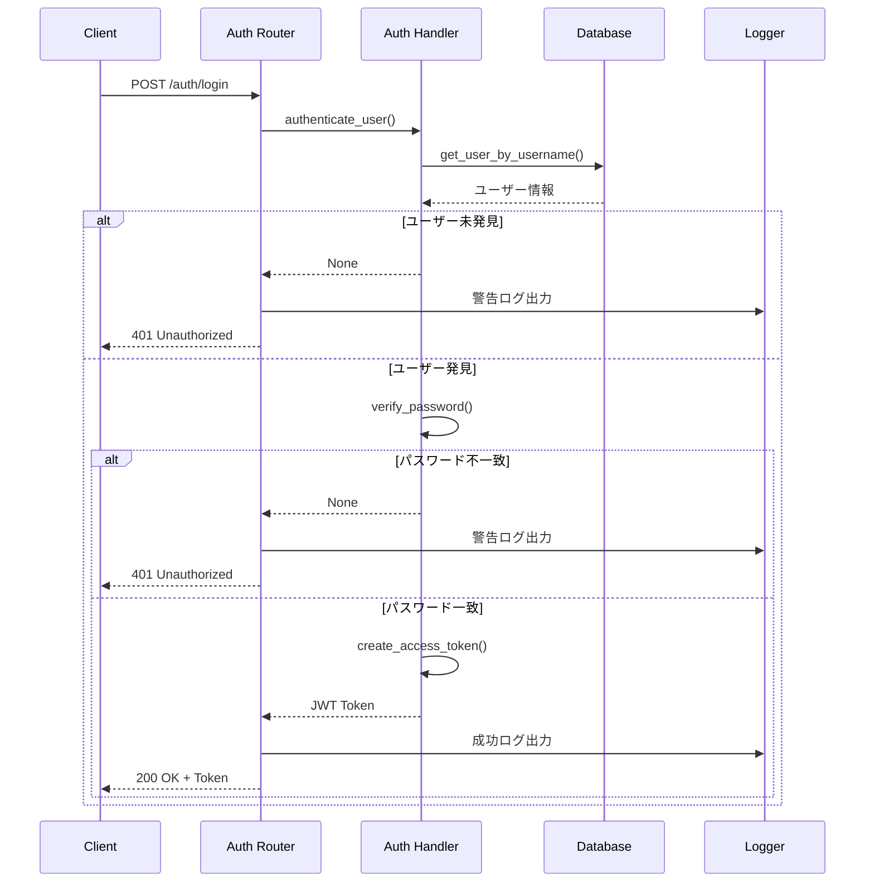
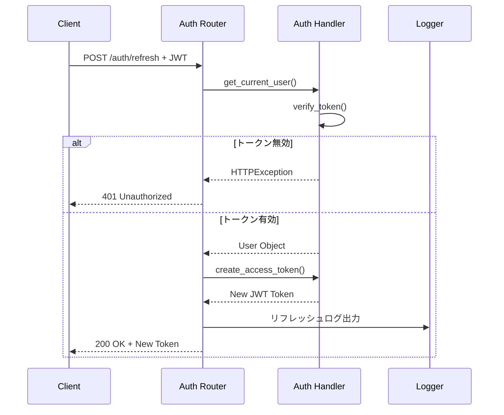
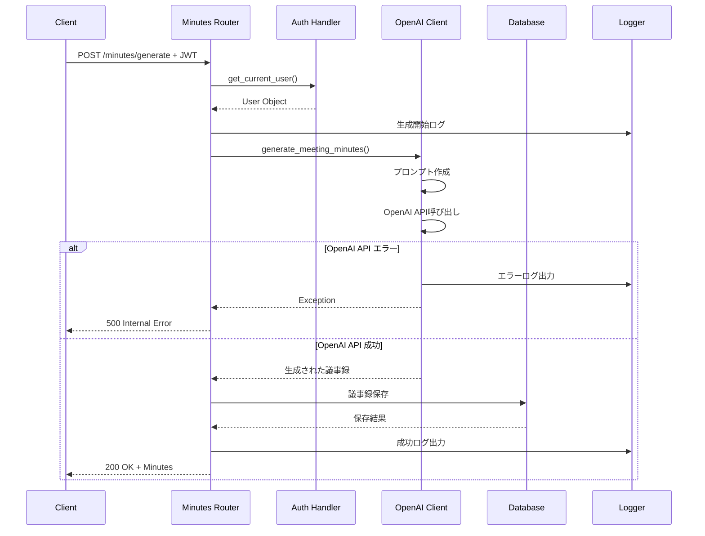
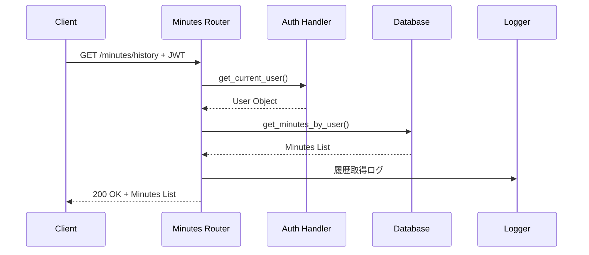
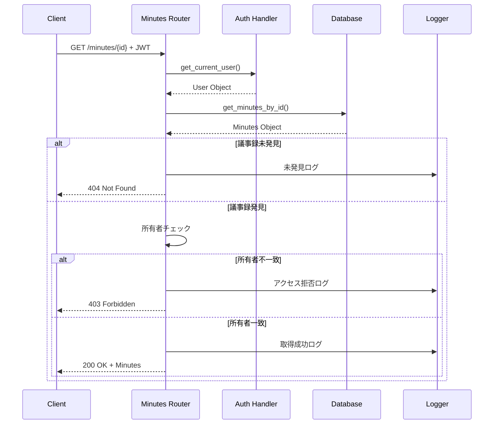
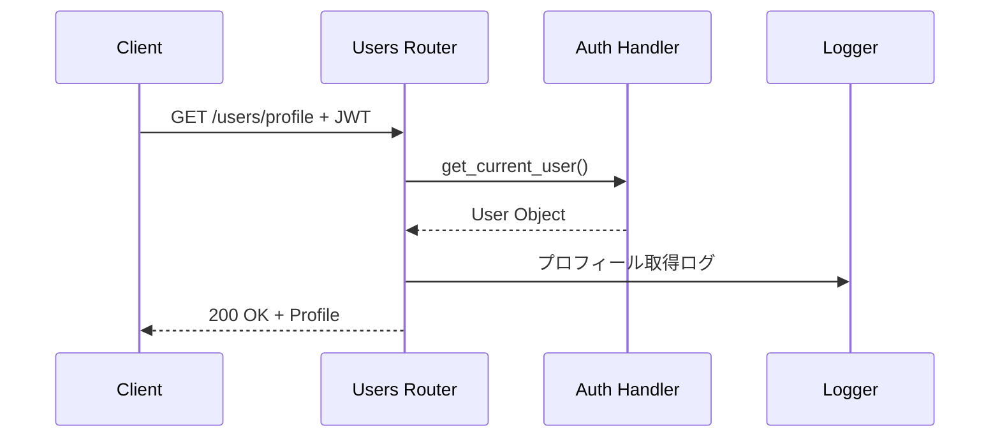
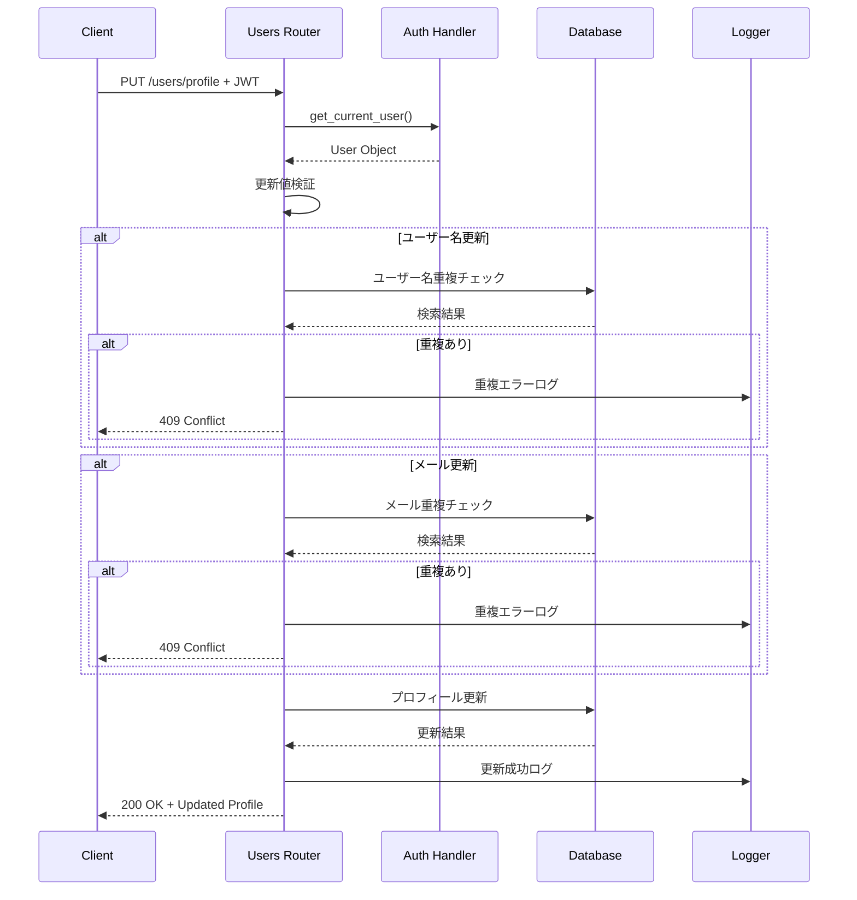
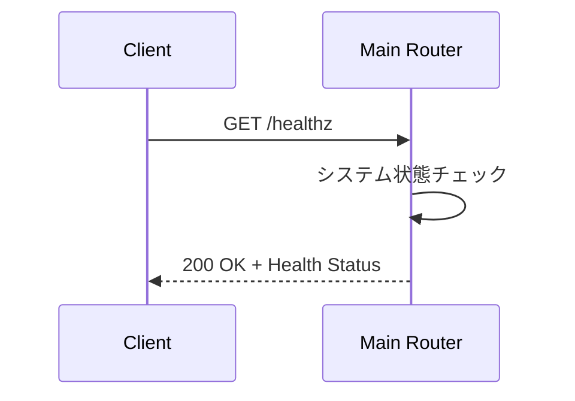
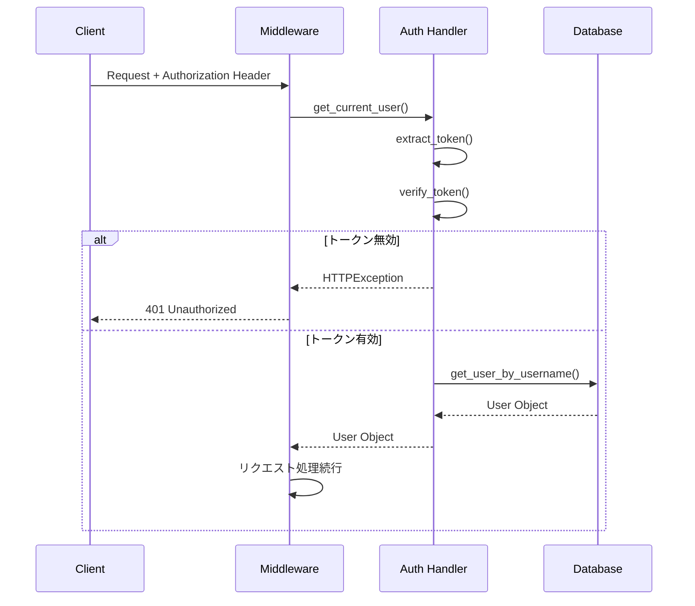

# エンドポイント設計書

## 1. 概要

### 目的
トランスクリプトから議事録作成APIシステムの各エンドポイントの詳細設計を定義し、実装時の具体的な仕様を明確化する

### 対象範囲
- 全APIエンドポイントの詳細設計
- 認証フロー設計
- データ処理フロー設計
- エラーハンドリング設計

### 前提条件
- FastAPI フレームワークの使用
- JWT認証システムの実装
- Pydantic による入力値検証

## 2. 設計方針

### 基本方針
- **RESTful設計**: REST原則に準拠したエンドポイント設計
- **セキュリティファースト**: 適切な認証・認可の実装
- **一貫性**: 統一されたレスポンス形式
- **拡張性**: 将来的な機能追加に対応可能

### 制約事項
- JWT トークンの有効期限管理
- OpenAI API の利用制限
- SQLite データベースの制限

### 品質要件
- **応答時間**: 各エンドポイントの応答時間要件
- **可用性**: 99.9%以上のアップタイム
- **セキュリティ**: OWASP Top 10 対応

## 3. 認証系エンドポイント

### 3.1 ユーザー登録エンドポイント

#### エンドポイント仕様
```
POST /auth/register
Content-Type: application/json
```

#### 処理フロー


#### 実装詳細
```python
@router.post("/register", response_model=UserResponse)
async def register_user(user: UserCreate, db: Session = Depends(get_db)):
    logger.info(f"User registration attempt for username: {user.username}")
    
    # ユーザー名重複チェック
    existing_user = get_user_by_username(db, user.username)
    if existing_user:
        logger.warning(f"Registration failed: username {user.username} already exists")
        raise HTTPException(
            status_code=status.HTTP_400_BAD_REQUEST,
            detail="Username already registered"
        )
    
    # メールアドレス重複チェック
    existing_email = get_user_by_email(db, user.email)
    if existing_email:
        logger.warning(f"Registration failed: email {user.email} already exists")
        raise HTTPException(
            status_code=status.HTTP_400_BAD_REQUEST,
            detail="Email already registered"
        )
    
    try:
        # ユーザー作成
        db_user = create_user(db, user.username, user.email, user.password)
        logger.info(f"User registered successfully: {user.username}")
        return UserResponse(
            id=db_user.id,
            username=db_user.username,
            email=db_user.email,
            created_at=db_user.created_at.isoformat()
        )
    except Exception as e:
        logger.error(f"User registration failed: {str(e)}")
        raise HTTPException(
            status_code=status.HTTP_500_INTERNAL_SERVER_ERROR,
            detail="Failed to create user"
        )
```

#### バリデーション仕様
- **username**: 3-50文字、英数字・アンダースコア・ハイフンのみ
- **email**: 有効なメールアドレス形式、最大100文字
- **password**: 最小8文字

#### エラーハンドリング
- **400**: バリデーションエラー
- **409**: ユーザー名またはメールアドレス重複
- **500**: サーバー内部エラー

### 3.2 ユーザーログインエンドポイント

#### エンドポイント仕様
```
POST /auth/login
Content-Type: application/json
```

#### 処理フロー


#### 実装詳細
```python
@router.post("/login", response_model=Token)
async def login_user(user_credentials: UserLogin, db: Session = Depends(get_db)):
    logger.info(f"Login attempt for username: {user_credentials.username}")
    
    # ユーザー認証
    user = authenticate_user(db, user_credentials.username, user_credentials.password)
    if not user:
        logger.warning(f"Login failed for username: {user_credentials.username}")
        raise HTTPException(
            status_code=status.HTTP_401_UNAUTHORIZED,
            detail="Incorrect username or password",
            headers={"WWW-Authenticate": "Bearer"},
        )
    
    # JWT トークン生成
    access_token_expires = timedelta(minutes=int(os.getenv("ACCESS_TOKEN_EXPIRE_MINUTES", "1440")))
    access_token = create_access_token(
        data={"sub": user.username}, expires_delta=access_token_expires
    )
    
    logger.info(f"User logged in successfully: {user_credentials.username}")
    return {"access_token": access_token, "token_type": "bearer"}
```

#### セキュリティ考慮事項
- パスワードのハッシュ化検証
- ログイン失敗時の情報漏洩防止
- レート制限の実装

### 3.3 トークンリフレッシュエンドポイント

#### エンドポイント仕様
```
POST /auth/refresh
Authorization: Bearer <JWT_TOKEN>
```

#### 処理フロー


## 4. 議事録系エンドポイント

### 4.1 議事録生成エンドポイント

#### エンドポイント仕様
```
POST /minutes/generate
Authorization: Bearer <JWT_TOKEN>
Content-Type: application/json
```

#### 処理フロー


#### 実装詳細
```python
@router.post("/generate", response_model=MinutesResponse)
async def generate_minutes(
    minutes_data: MinutesGenerate,
    current_user: User = Depends(get_current_user),
    db: Session = Depends(get_db)
):
    logger.info(f"Generating minutes for user: {current_user.username}")
    
    try:
        # OpenAI API で議事録生成
        generated_content = await generate_meeting_minutes(
            minutes_data.transcript, 
            minutes_data.title
        )
        
        # データベースに保存
        minutes_create = MinutesCreate(
            user_id=current_user.id,
            title=minutes_data.title,
            transcript=minutes_data.transcript,
            generated_minutes=generated_content
        )
        
        db_minutes = Minutes(**minutes_create.dict())
        db.add(db_minutes)
        db.commit()
        db.refresh(db_minutes)
        
        logger.info(f"Minutes generated successfully for user: {current_user.username}")
        return MinutesResponse.from_orm(db_minutes)
        
    except Exception as e:
        logger.error(f"Failed to generate minutes: {str(e)}")
        raise HTTPException(
            status_code=status.HTTP_500_INTERNAL_SERVER_ERROR,
            detail=f"Failed to generate meeting minutes: {str(e)}"
        )
```

#### パフォーマンス考慮事項
- 非同期処理による応答性向上
- OpenAI API のタイムアウト設定
- 大容量トランスクリプトの処理制限

### 4.2 議事録履歴取得エンドポイント

#### エンドポイント仕様
```
GET /minutes/history?skip=0&limit=10
Authorization: Bearer <JWT_TOKEN>
```

#### 処理フロー


#### 実装詳細
```python
@router.get("/history", response_model=List[MinutesResponse])
async def get_minutes_history(
    current_user: User = Depends(get_current_user),
    db: Session = Depends(get_db),
    skip: int = 0,
    limit: int = 10
):
    logger.info(f"Getting minutes history for user: {current_user.username}")
    
    # ページネーション制限
    limit = min(limit, 100)
    
    # ユーザーの議事録履歴取得
    minutes_list = db.query(Minutes).filter(
        Minutes.user_id == current_user.id
    ).order_by(
        Minutes.created_at.desc()
    ).offset(skip).limit(limit).all()
    
    logger.info(f"Retrieved {len(minutes_list)} minutes for user: {current_user.username}")
    return [MinutesResponse.from_orm(minutes) for minutes in minutes_list]
```

#### ページネーション仕様
- **skip**: スキップする件数（デフォルト: 0）
- **limit**: 取得する最大件数（デフォルト: 10、最大: 100）

### 4.3 特定議事録取得エンドポイント

#### エンドポイント仕様
```
GET /minutes/{minutes_id}
Authorization: Bearer <JWT_TOKEN>
```

#### 処理フロー


#### 実装詳細
```python
@router.get("/{minutes_id}", response_model=MinutesResponse)
async def get_minutes_by_id(
    minutes_id: int,
    current_user: User = Depends(get_current_user),
    db: Session = Depends(get_db)
):
    logger.info(f"Getting minutes {minutes_id} for user: {current_user.username}")
    
    # 議事録取得
    minutes = db.query(Minutes).filter(Minutes.id == minutes_id).first()
    if not minutes:
        logger.warning(f"Minutes {minutes_id} not found")
        raise HTTPException(
            status_code=status.HTTP_404_NOT_FOUND,
            detail="Minutes not found"
        )
    
    # 所有者チェック
    if minutes.user_id != current_user.id:
        logger.warning(f"Access denied: user {current_user.username} tried to access minutes {minutes_id}")
        raise HTTPException(
            status_code=status.HTTP_403_FORBIDDEN,
            detail="Access denied: You can only access your own minutes"
        )
    
    logger.info(f"Minutes {minutes_id} retrieved successfully")
    return MinutesResponse.from_orm(minutes)
```

## 5. ユーザー管理系エンドポイント

### 5.1 プロフィール取得エンドポイント

#### エンドポイント仕様
```
GET /users/profile
Authorization: Bearer <JWT_TOKEN>
```

#### 処理フロー


#### 実装詳細
```python
@router.get("/profile", response_model=UserResponse)
async def get_user_profile(
    current_user: User = Depends(get_current_user)
):
    logger.info(f"Getting profile for user: {current_user.username}")
    return UserResponse(
        username=current_user.username,
        email=current_user.email
    )
```

### 5.2 プロフィール更新エンドポイント

#### エンドポイント仕様
```
PUT /users/profile
Authorization: Bearer <JWT_TOKEN>
Content-Type: application/json
```

#### 処理フロー


## 6. システム系エンドポイント

### 6.1 ヘルスチェックエンドポイント

#### エンドポイント仕様
```
GET /healthz
```

#### 処理フロー


#### 実装詳細
```python
@app.get("/healthz")
async def healthz():
    return {"status": "ok", "message": "Transcript to Meeting Minutes API is running"}
```

### 6.2 ルートエンドポイント

#### エンドポイント仕様
```
GET /
```

#### 実装詳細
```python
@app.get("/")
async def root():
    return {
        "message": "Welcome to Transcript to Meeting Minutes API",
        "docs": "/docs",
        "redoc": "/redoc"
    }
```

## 7. 共通処理設計

### 7.1 認証処理

#### JWT認証フロー


### 7.2 エラーハンドリング

#### 共通エラーレスポンス形式
```python
# HTTPException の使用
raise HTTPException(
    status_code=status.HTTP_400_BAD_REQUEST,
    detail="Error message",
    headers={"WWW-Authenticate": "Bearer"}  # 必要に応じて
)
```

#### エラーログ出力
```python
# エラーレベル別のログ出力
logger.warning(f"Warning message: {details}")  # 警告レベル
logger.error(f"Error message: {str(e)}")       # エラーレベル
```

### 7.3 ログ出力

#### ログ出力項目
- **リクエスト開始**: エンドポイント、ユーザー情報
- **処理結果**: 成功/失敗、処理時間
- **エラー情報**: エラー詳細、スタックトレース

#### ログ出力例
```python
logger.info(f"User registration attempt for username: {username}")
logger.warning(f"Login failed for username: {username}")
logger.error(f"OpenAI API error: {str(e)}")
```

## 8. 実装考慮事項

### 開発時の注意点
- **依存性注入**: FastAPI の Depends を適切に使用
- **非同期処理**: OpenAI API 呼び出しの非同期実装
- **エラーハンドリング**: 適切な HTTP ステータスコードの返却
- **ログ出力**: 個人情報を含まないログ設計

### 既知の課題
- OpenAI API の利用制限による処理時間の変動
- SQLite の同時書き込み制限
- JWT トークンの無効化機能未実装

### 代替案
- **データベース**: PostgreSQL への移行検討
- **認証**: OAuth 2.0 対応
- **AI連携**: 複数AIモデルの選択機能

## 9. テスト観点

### テスト項目
- **正常系テスト**: 各エンドポイントの正常動作確認
- **異常系テスト**: エラーケースの動作確認
- **認証テスト**: JWT認証の動作確認
- **パフォーマンステスト**: 応答時間の測定

### 検証方法
- **単体テスト**: 各エンドポイントの個別テスト
- **統合テスト**: エンドツーエンドのシナリオテスト
- **負荷テスト**: 高負荷時の動作確認

### 合格基準
- **機能**: 全エンドポイントの正常動作
- **パフォーマンス**: 応答時間要件の満足
- **セキュリティ**: 認証・認可の適切な動作

## 10. 運用考慮事項

### 運用時の注意点
- **エンドポイント監視**: 各エンドポイントの応答時間とエラー率
- **認証監視**: ログイン失敗率と不正アクセス検知
- **リソース監視**: CPU・メモリ使用率の監視

### 監視項目
- **API メトリクス**: 応答時間、エラー率、スループット
- **認証メトリクス**: ログイン成功率、トークン使用状況
- **ビジネスメトリクス**: 議事録生成数、ユーザー活動

### 保守方法
- **エンドポイント更新**: 個別エンドポイントの独立更新
- **設定変更**: 環境変数による動的設定変更
- **ログ分析**: エンドポイント別のログ分析

---

**作成日**: 2025年6月23日  
**作成者**: Devin AI  
**バージョン**: 1.0  
**承認者**: 未承認
