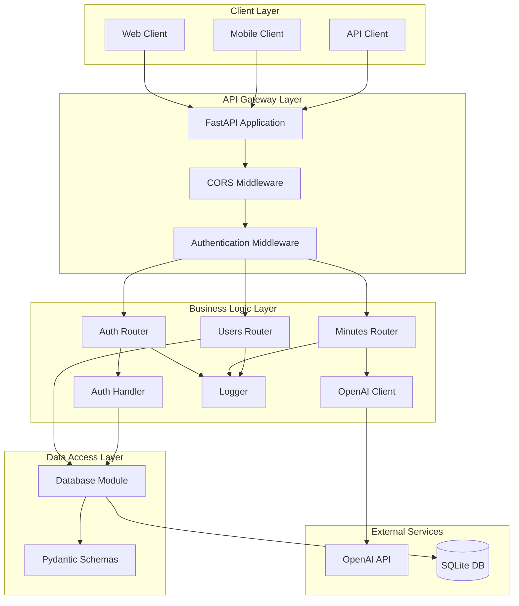
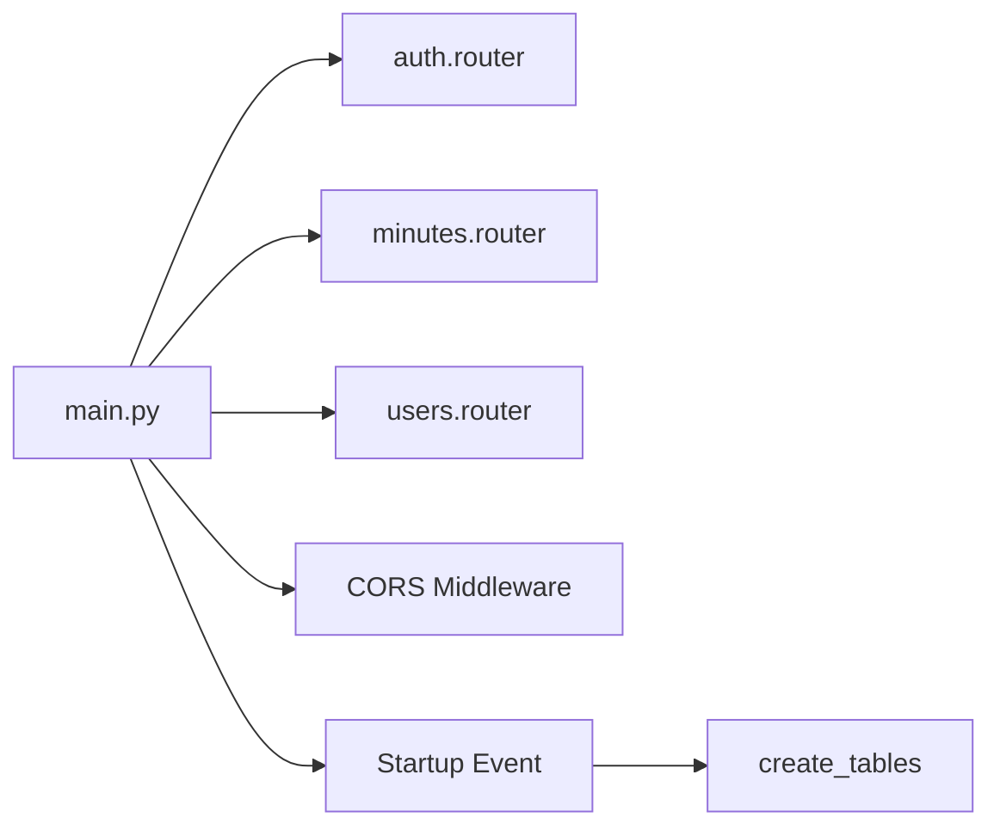
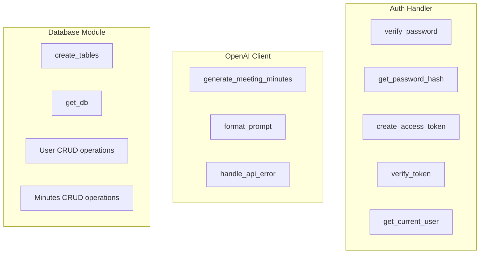
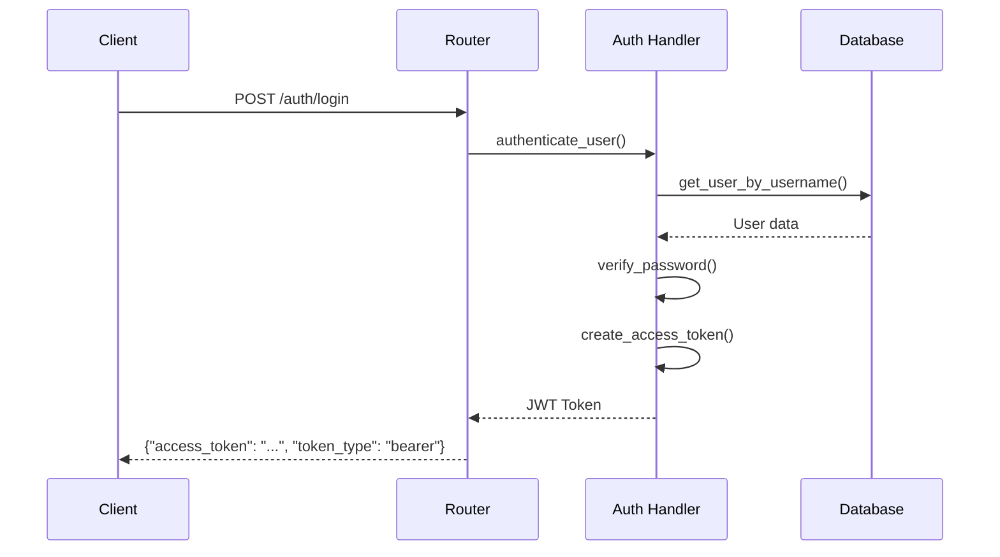
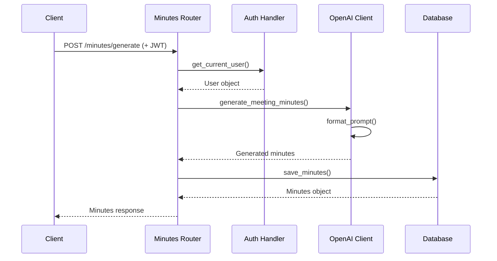
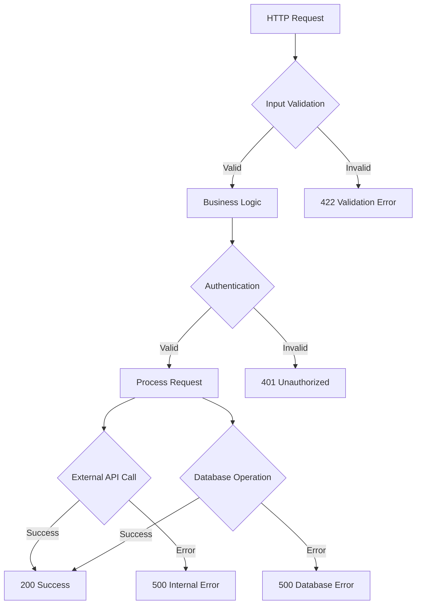
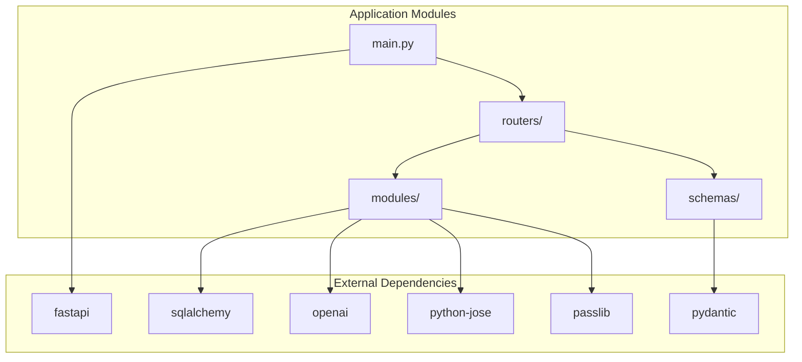
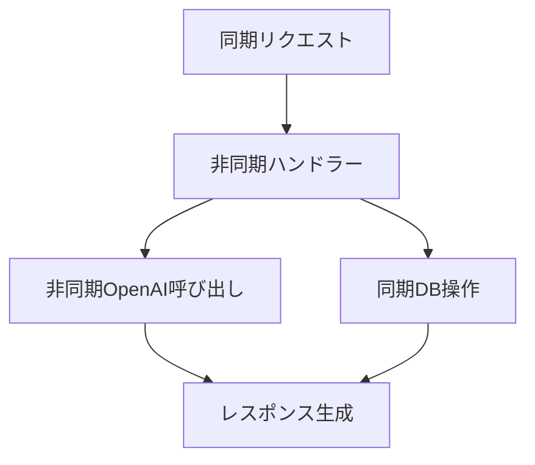
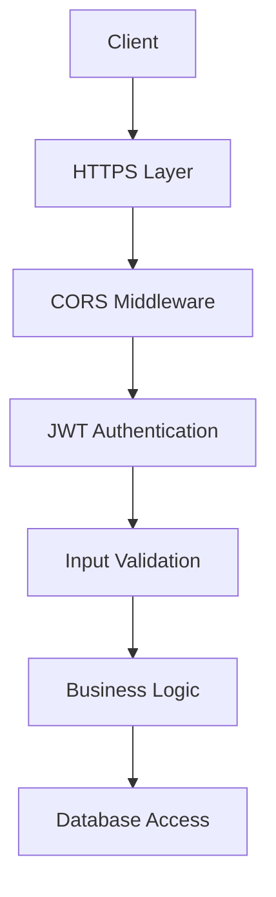
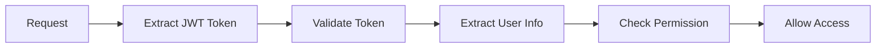

# アーキテクチャ設計書

## 1. 概要

### 目的
トランスクリプトから議事録作成APIシステムのアーキテクチャ設計を詳細に定義し、システム全体の構造と各コンポーネント間の関係を明確化する

### 対象範囲
- レイヤー構成とコンポーネント設計
- データフローとプロセス設計
- 依存関係とインターフェース設計
- デプロイメント構成

### 前提条件
- FastAPI フレームワークの使用
- RESTful API 設計原則の適用
- マイクロサービス指向アーキテクチャ

## 2. 設計方針

### 基本方針
- **レイヤード アーキテクチャ**: 責務の明確な分離
- **依存性注入**: 疎結合な設計
- **非同期処理**: I/O集約的処理の最適化
- **設定外部化**: 環境に依存しない設計

### 制約事項
- 単一プロセス内での実行
- SQLite データベースの制限
- OpenAI API の外部依存

### 品質要件
- **保守性**: 変更影響の局所化
- **テスタビリティ**: 単体テスト可能な設計
- **拡張性**: 新機能追加の容易さ

## 3. システムアーキテクチャ

### 全体アーキテクチャ図


### レイヤー構成

#### 1. プレゼンテーション層 (Presentation Layer)
- **責務**: HTTP リクエスト/レスポンスの処理
- **コンポーネント**: FastAPI ルーター
- **技術**: FastAPI, Pydantic

#### 2. ビジネスロジック層 (Business Logic Layer)
- **責務**: アプリケーションの核となる処理
- **コンポーネント**: 各種ハンドラー、サービス
- **技術**: Python, 非同期処理

#### 3. データアクセス層 (Data Access Layer)
- **責務**: データの永続化と取得
- **コンポーネント**: データベースモジュール
- **技術**: SQLAlchemy ORM

#### 4. 外部連携層 (External Integration Layer)
- **責務**: 外部サービスとの連携
- **コンポーネント**: OpenAI クライアント
- **技術**: HTTP クライアント, 非同期処理

## 4. コンポーネント設計

### ディレクトリ構造とコンポーネント対応
```
app/
├── main.py                    # アプリケーションエントリーポイント
├── routers/                   # プレゼンテーション層
│   ├── __init__.py
│   ├── auth.py               # 認証エンドポイント
│   ├── minutes.py            # 議事録エンドポイント
│   └── users.py              # ユーザーエンドポイント
├── modules/                   # ビジネスロジック層
│   ├── __init__.py
│   ├── auth_handler.py       # 認証処理
│   ├── openai_client.py      # OpenAI連携
│   ├── database.py           # データアクセス
│   └── logger.py             # ログ処理
└── schemas/                   # データ定義層
    ├── __init__.py
    ├── auth.py               # 認証スキーマ
    ├── minutes.py            # 議事録スキーマ
    └── users.py              # ユーザースキーマ
```

### コンポーネント詳細

#### FastAPI Application (main.py)


**責務**:
- アプリケーションの初期化
- ルーターの登録
- ミドルウェアの設定
- 起動時処理

#### Router Layer
```mermaid
graph TB
    subgraph "Auth Router"
        AuthRegister[POST /auth/register]
        AuthLogin[POST /auth/login]
        AuthRefresh[POST /auth/refresh]
    end
    
    subgraph "Minutes Router"
        MinutesGenerate[POST /minutes/generate]
        MinutesHistory[GET /minutes/history]
        MinutesDetail[GET /minutes/{id}]
    end
    
    subgraph "Users Router"
        UserProfile[GET /users/profile]
        UserUpdate[PUT /users/profile]
    end
```

**責務**:
- HTTP リクエストの受信
- 入力値の検証
- ビジネスロジックの呼び出し
- HTTP レスポンスの生成

#### Business Logic Layer


**責務**:
- 認証・認可処理
- 外部API連携
- データベース操作
- ビジネスルールの実装

## 5. データフロー設計

### 認証フロー


### 議事録生成フロー


### エラーハンドリングフロー


## 6. 依存関係設計

### モジュール依存関係図


### 依存性注入パターン
```python
# 依存性注入の例
def get_current_user(
    credentials: HTTPAuthorizationCredentials = Depends(security),
    db: Session = Depends(get_db)
) -> User:
    # 認証処理
    pass

@router.post("/generate")
async def generate_minutes(
    minutes_data: MinutesGenerate,
    current_user: User = Depends(get_current_user),
    db: Session = Depends(get_db)
):
    # 議事録生成処理
    pass
```

## 7. 非同期処理設計

### 非同期処理パターン


### 実装パターン
```python
# 非同期処理の実装例
async def generate_meeting_minutes(transcript: str, title: Optional[str] = None) -> str:
    # OpenAI API の非同期呼び出し
    response = await client.chat.completions.create(
        model=OPENAI_MODEL,
        messages=[...],
        max_tokens=2000,
        temperature=0.3
    )
    return response.choices[0].message.content.strip()
```

## 8. セキュリティアーキテクチャ

### セキュリティ層構成


### 認証・認可フロー


## 9. 実装考慮事項

### 開発時の注意点
- **循環依存の回避**: モジュール間の依存関係を適切に設計
- **設定の外部化**: 環境変数による設定管理
- **エラーハンドリング**: 適切な例外処理とログ出力
- **テスタビリティ**: 依存性注入によるテスト容易性

### 既知の課題
- SQLite の同時アクセス制限
- OpenAI API のレート制限
- JWT トークンの無効化機能未実装

### 代替案
- **データベース**: PostgreSQL への移行
- **認証**: Redis を使用したトークン管理
- **負荷分散**: 複数インスタンスでの運用

## 10. テスト観点

### テスト項目
- **単体テスト**: 各モジュールの独立テスト
- **統合テスト**: コンポーネント間の連携テスト
- **E2Eテスト**: エンドツーエンドのシナリオテスト

### 検証方法
- **モックの使用**: 外部依存のモック化
- **テストデータベース**: 独立したテスト環境
- **非同期テスト**: pytest-asyncio の使用

### 合格基準
- **カバレッジ**: 80%以上のコードカバレッジ
- **パフォーマンス**: 応答時間要件の満足
- **セキュリティ**: 脆弱性テストの合格

## 11. 運用考慮事項

### 運用時の注意点
- **ログ監視**: 各層でのログ出力と監視
- **メトリクス収集**: パフォーマンス指標の収集
- **ヘルスチェック**: システム状態の定期確認

### 監視項目
- **アプリケーション**: API応答時間、エラー率
- **インフラ**: CPU、メモリ、ディスク使用率
- **外部依存**: OpenAI API の応答時間と成功率

### 保守方法
- **ローリングアップデート**: 無停止でのアップデート
- **設定変更**: 環境変数による動的設定変更
- **ログローテーション**: ログファイルの適切な管理

---

**作成日**: 2025年6月23日  
**作成者**: Devin AI  
**バージョン**: 1.0  
**承認者**: 未承認
