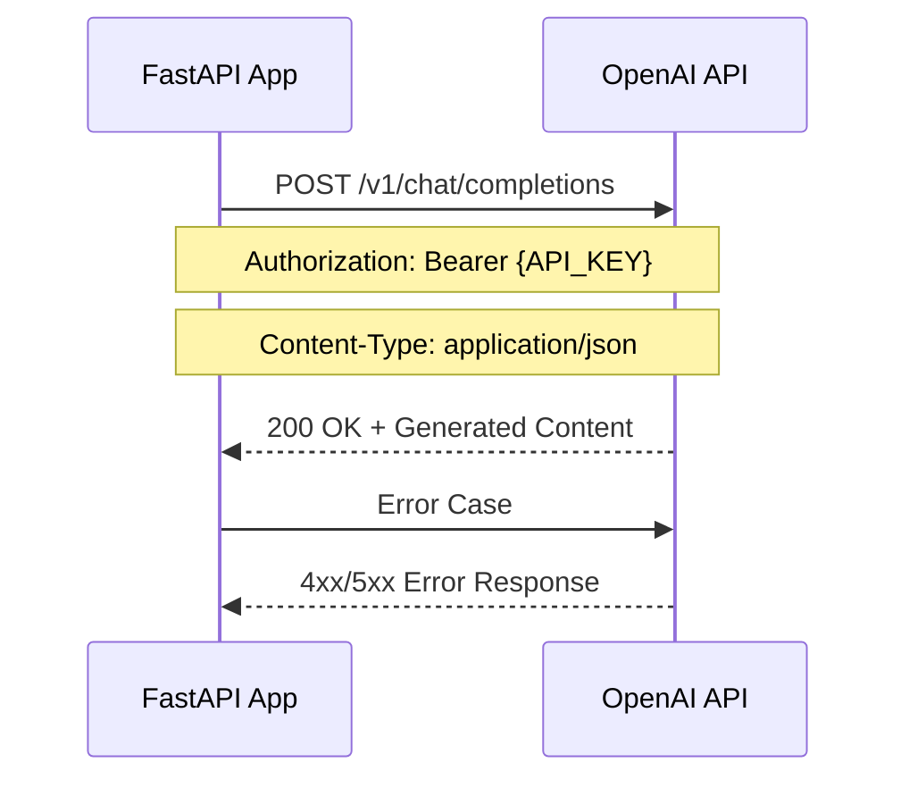

# インターフェース設計書

## 1. 概要

### 目的
トランスクリプトから議事録作成APIシステムの外部システムとの連携インターフェースを詳細に定義し、システム間の通信仕様を明確化する

### 対象範囲
- OpenAI API との連携インターフェース
- クライアントアプリケーションとのHTTP API インターフェース
- データベースアクセスインターフェース
- ログ出力インターフェース

### 前提条件
- RESTful API 設計原則の適用
- JSON 形式でのデータ交換
- HTTP/HTTPS プロトコルの使用

## 2. 設計方針

### 基本方針
- **標準準拠**: OpenAPI 3.0 仕様に準拠
- **一貫性**: 統一されたインターフェース設計
- **拡張性**: 将来的な機能追加に対応可能
- **セキュリティ**: 適切な認証・認可の実装

### 制約事項
- OpenAI API の利用制限
- HTTP リクエスト/レスポンスサイズの制限
- JWT トークンの有効期限

### 品質要件
- **可用性**: 99.9%以上のアップタイム
- **応答性**: API応答時間の最適化
- **セキュリティ**: データ保護の徹底

## 3. 外部システム連携インターフェース

### 3.1 OpenAI API 連携

#### 接続仕様


#### リクエスト仕様
```json
{
  "model": "gpt-3.5-turbo",
  "messages": [
    {
      "role": "system",
      "content": "あなたは会議の議事録作成の専門家です。"
    },
    {
      "role": "user", 
      "content": "以下のトランスクリプトを基に、構造化された議事録を作成してください。\n\n【トランスクリプト】\n{transcript}"
    }
  ],
  "max_tokens": 2000,
  "temperature": 0.3
}
```

#### レスポンス仕様
```json
{
  "id": "chatcmpl-xxx",
  "object": "chat.completion",
  "created": 1677652288,
  "model": "gpt-3.5-turbo",
  "choices": [
    {
      "index": 0,
      "message": {
        "role": "assistant",
        "content": "# 会議議事録\n## 日時・参加者\n..."
      },
      "finish_reason": "stop"
    }
  ],
  "usage": {
    "prompt_tokens": 56,
    "completion_tokens": 31,
    "total_tokens": 87
  }
}
```

#### エラーハンドリング
```python
# エラーレスポンス例
{
  "error": {
    "message": "You exceeded your current quota",
    "type": "insufficient_quota",
    "param": null,
    "code": "insufficient_quota"
  }
}
```

#### 実装詳細
```python
async def generate_meeting_minutes(transcript: str, title: Optional[str] = None) -> str:
    try:
        response = await client.chat.completions.create(
            model=OPENAI_MODEL,
            messages=[
                {"role": "system", "content": "あなたは会議の議事録作成の専門家です。"},
                {"role": "user", "content": prompt}
            ],
            max_tokens=2000,
            temperature=0.3
        )
        return response.choices[0].message.content.strip()
    except Exception as e:
        logger.error(f"OpenAI API error: {str(e)}")
        raise Exception(f"Failed to generate meeting minutes: {str(e)}")
```

## 4. HTTP API インターフェース

### 4.1 認証系API

#### POST /auth/register
```yaml
summary: ユーザー登録
requestBody:
  required: true
  content:
    application/json:
      schema:
        type: object
        properties:
          username:
            type: string
            minLength: 3
            maxLength: 50
          email:
            type: string
            format: email
          password:
            type: string
            minLength: 8
        required: [username, email, password]
responses:
  200:
    description: 登録成功
    content:
      application/json:
        schema:
          type: object
          properties:
            id: {type: integer}
            username: {type: string}
            email: {type: string}
            created_at: {type: string, format: date-time}
  400:
    description: バリデーションエラー
  409:
    description: ユーザー名またはメールアドレスが既に存在
```

#### POST /auth/login
```yaml
summary: ユーザーログイン
requestBody:
  required: true
  content:
    application/json:
      schema:
        type: object
        properties:
          username: {type: string}
          password: {type: string}
        required: [username, password]
responses:
  200:
    description: ログイン成功
    content:
      application/json:
        schema:
          type: object
          properties:
            access_token: {type: string}
            token_type: {type: string, enum: [bearer]}
  401:
    description: 認証失敗
```

#### POST /auth/refresh
```yaml
summary: トークンリフレッシュ
security:
  - bearerAuth: []
responses:
  200:
    description: リフレッシュ成功
    content:
      application/json:
        schema:
          type: object
          properties:
            access_token: {type: string}
            token_type: {type: string, enum: [bearer]}
  401:
    description: 無効なトークン
```

### 4.2 議事録系API

#### POST /minutes/generate
```yaml
summary: 議事録生成
security:
  - bearerAuth: []
requestBody:
  required: true
  content:
    application/json:
      schema:
        type: object
        properties:
          transcript:
            type: string
            minLength: 10
          title:
            type: string
            maxLength: 200
        required: [transcript]
responses:
  200:
    description: 生成成功
    content:
      application/json:
        schema:
          type: object
          properties:
            id: {type: integer}
            user_id: {type: integer}
            title: {type: string, nullable: true}
            transcript: {type: string}
            generated_minutes: {type: string}
            created_at: {type: string, format: date-time}
  401:
    description: 認証が必要
  500:
    description: 議事録生成エラー
```

#### GET /minutes/history
```yaml
summary: 議事録履歴取得
security:
  - bearerAuth: []
parameters:
  - name: skip
    in: query
    schema: {type: integer, minimum: 0, default: 0}
  - name: limit
    in: query
    schema: {type: integer, minimum: 1, maximum: 100, default: 10}
responses:
  200:
    description: 取得成功
    content:
      application/json:
        schema:
          type: array
          items:
            type: object
            properties:
              id: {type: integer}
              title: {type: string, nullable: true}
              created_at: {type: string, format: date-time}
  401:
    description: 認証が必要
```

#### GET /minutes/{minutes_id}
```yaml
summary: 特定議事録取得
security:
  - bearerAuth: []
parameters:
  - name: minutes_id
    in: path
    required: true
    schema: {type: integer}
responses:
  200:
    description: 取得成功
    content:
      application/json:
        schema:
          type: object
          properties:
            id: {type: integer}
            user_id: {type: integer}
            title: {type: string, nullable: true}
            transcript: {type: string}
            generated_minutes: {type: string}
            created_at: {type: string, format: date-time}
  401:
    description: 認証が必要
  403:
    description: アクセス権限なし
  404:
    description: 議事録が見つからない
```

### 4.3 ユーザー管理系API

#### GET /users/profile
```yaml
summary: プロフィール取得
security:
  - bearerAuth: []
responses:
  200:
    description: 取得成功
    content:
      application/json:
        schema:
          type: object
          properties:
            username: {type: string}
            email: {type: string}
  401:
    description: 認証が必要
```

#### PUT /users/profile
```yaml
summary: プロフィール更新
security:
  - bearerAuth: []
requestBody:
  required: true
  content:
    application/json:
      schema:
        type: object
        properties:
          username:
            type: string
            minLength: 3
            maxLength: 50
          email:
            type: string
            format: email
responses:
  200:
    description: 更新成功
    content:
      application/json:
        schema:
          type: object
          properties:
            username: {type: string}
            email: {type: string}
  400:
    description: バリデーションエラー
  401:
    description: 認証が必要
  409:
    description: ユーザー名またはメールアドレスが既に存在
```

## 5. データベースアクセスインターフェース

### 5.1 データベース接続仕様
```python
# 接続設定
DATABASE_URL = os.getenv("DATABASE_URL", "sqlite:///./app.db")
engine = create_engine(DATABASE_URL, connect_args={"check_same_thread": False})
SessionLocal = sessionmaker(autocommit=False, autoflush=False, bind=engine)

# 依存性注入
def get_db():
    db = SessionLocal()
    try:
        yield db
    finally:
        db.close()
```

### 5.2 CRUD操作インターフェース
```python
# User CRUD
def create_user(db: Session, username: str, email: str, password: str) -> User
def get_user_by_username(db: Session, username: str) -> Optional[User]
def get_user_by_email(db: Session, email: str) -> Optional[User]
def update_user(db: Session, user: User, **kwargs) -> User

# Minutes CRUD
def create_minutes(db: Session, minutes_data: MinutesCreate) -> Minutes
def get_minutes_by_user(db: Session, user_id: int, skip: int = 0, limit: int = 10) -> List[Minutes]
def get_minutes_by_id(db: Session, minutes_id: int) -> Optional[Minutes]
```

## 6. ログ出力インターフェース

### 6.1 ログ設定
```python
# ログ設定
LOG_LEVEL = os.getenv("LOG_LEVEL", "INFO").upper()
LOG_FILE = os.getenv("LOG_FILE", "app.log")
LOG_FORMAT = '%(asctime)s - %(name)s - %(levelname)s - %(message)s'

# ログ出力例
logger.info(f"User registration attempt for username: {username}")
logger.warning(f"Login failed for username: {username}")
logger.error(f"OpenAI API error: {str(e)}")
```

### 6.2 ログ出力項目
- **タイムスタンプ**: ISO 8601 形式
- **ログレベル**: DEBUG, INFO, WARNING, ERROR, CRITICAL
- **モジュール名**: ログ出力元の識別
- **メッセージ**: 具体的な処理内容
- **ユーザーID**: 認証済みの場合のみ
- **処理時間**: 重要な処理の実行時間

## 7. セキュリティインターフェース

### 7.1 認証インターフェース
```python
# JWT トークン検証
def verify_token(token: str, credentials_exception):
    try:
        payload = jwt.decode(token, SECRET_KEY, algorithms=[ALGORITHM])
        username: str = payload.get("sub")
        if username is None:
            raise credentials_exception
        token_data = TokenData(username=username)
    except JWTError:
        raise credentials_exception
    return token_data

# 現在ユーザー取得
def get_current_user(
    credentials: HTTPAuthorizationCredentials = Depends(security),
    db: Session = Depends(get_db)
) -> User:
    credentials_exception = HTTPException(
        status_code=status.HTTP_401_UNAUTHORIZED,
        detail="Could not validate credentials",
        headers={"WWW-Authenticate": "Bearer"},
    )
    token_data = verify_token(credentials.credentials, credentials_exception)
    user = get_user_by_username(db, username=token_data.username)
    if user is None:
        raise credentials_exception
    return user
```

### 7.2 CORS設定
```python
app.add_middleware(
    CORSMiddleware,
    allow_origins=["*"],  # 本番環境では適切に制限
    allow_credentials=True,
    allow_methods=["*"],
    allow_headers=["*"],
)
```

## 8. エラーハンドリングインターフェース

### 8.1 HTTP エラーレスポンス
```python
# 標準エラーレスポンス形式
{
  "detail": "Error message",
  "status_code": 400,
  "timestamp": "2025-06-23T07:30:00Z"
}

# バリデーションエラー
{
  "detail": [
    {
      "loc": ["body", "username"],
      "msg": "ensure this value has at least 3 characters",
      "type": "value_error.any_str.min_length"
    }
  ]
}
```

### 8.2 エラーコード一覧
| ステータスコード | 説明 | 用途 |
|-----------------|------|------|
| 400 | Bad Request | 入力値エラー |
| 401 | Unauthorized | 認証エラー |
| 403 | Forbidden | 認可エラー |
| 404 | Not Found | リソース未発見 |
| 409 | Conflict | データ重複エラー |
| 422 | Unprocessable Entity | バリデーションエラー |
| 500 | Internal Server Error | サーバー内部エラー |

## 9. 実装考慮事項

### 開発時の注意点
- **API バージョニング**: 将来的なバージョン管理の考慮
- **レート制限**: API 使用量の制限実装
- **キャッシュ**: 頻繁にアクセスされるデータのキャッシュ
- **監視**: API 使用状況の監視とアラート

### 既知の課題
- OpenAI API のレート制限対応
- 大容量トランスクリプトの処理
- 同時接続数の制限

### 代替案
- **API Gateway**: 外部 API Gateway の使用検討
- **キューシステム**: 非同期処理のためのキューシステム
- **CDN**: 静的コンテンツの配信最適化

## 10. テスト観点

### テスト項目
- **API テスト**: 各エンドポイントの動作確認
- **統合テスト**: 外部システムとの連携テスト
- **負荷テスト**: 高負荷時の動作確認

### 検証方法
- **Swagger UI**: インタラクティブなAPI テスト
- **curl コマンド**: コマンドラインでのテスト
- **自動テスト**: pytest による自動テスト

### 合格基準
- **機能テスト**: 全エンドポイントの正常動作
- **パフォーマンステスト**: 応答時間要件の満足
- **セキュリティテスト**: 認証・認可の適切な動作

## 11. 運用考慮事項

### 運用時の注意点
- **API 監視**: エンドポイント別の監視
- **ログ分析**: アクセスパターンの分析
- **セキュリティ監視**: 不正アクセスの検知

### 監視項目
- **API メトリクス**: 応答時間、エラー率、スループット
- **外部依存**: OpenAI API の応答時間と成功率
- **セキュリティ**: 認証失敗率、異常なアクセスパターン

### 保守方法
- **API ドキュメント**: 最新状態の維持
- **バージョン管理**: 後方互換性の確保
- **セキュリティ更新**: 定期的なセキュリティパッチ適用

---

**作成日**: 2025年6月23日  
**作成者**: Devin AI  
**バージョン**: 1.0  
**承認者**: 未承認
