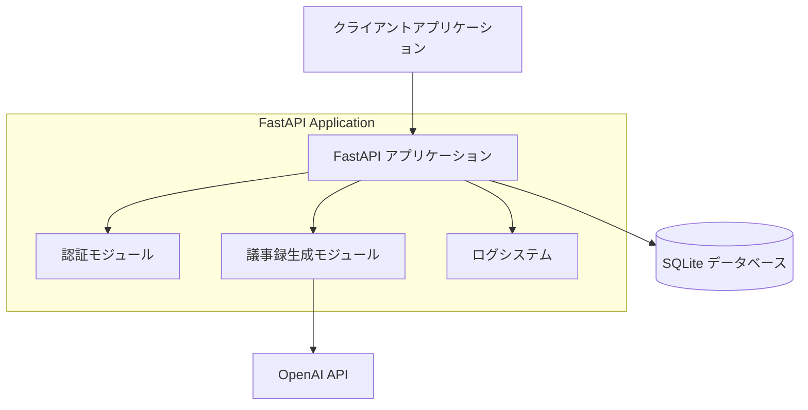
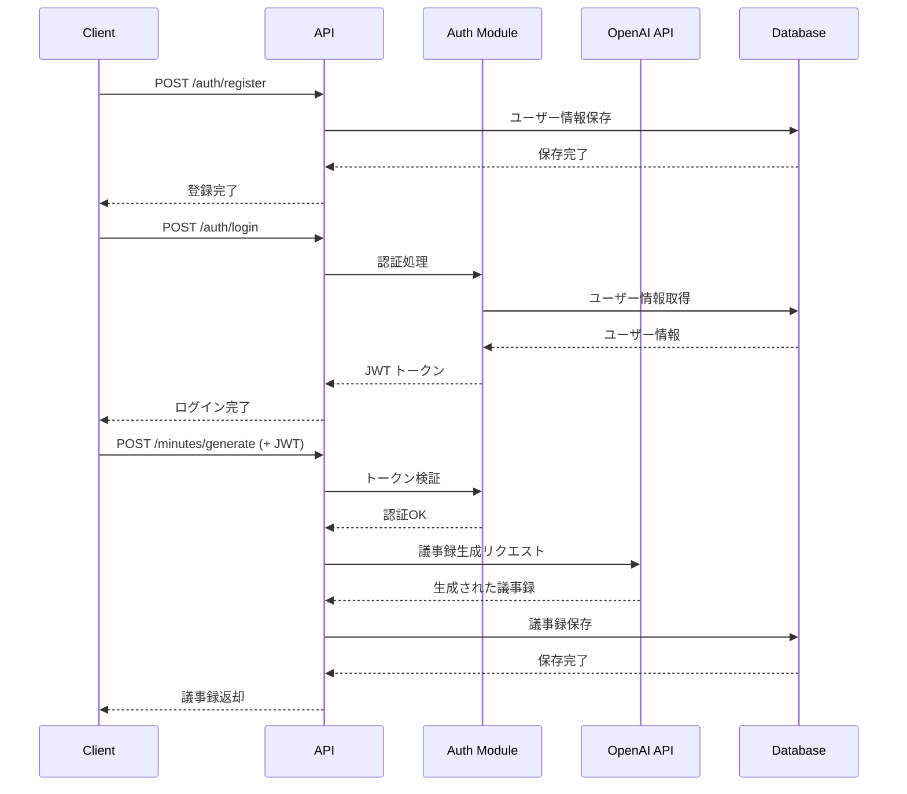

# システム概要設計書

## 1. 概要

### 目的
音声トランスクリプトを入力として、OpenAI APIを活用して構造化された議事録を自動生成するWebAPIシステムの詳細設計

### 対象範囲
- FastAPI ベースのRESTful API
- JWT認証システム
- OpenAI API連携による議事録生成機能
- SQLiteデータベースによるデータ永続化
- ログ機能とエラーハンドリング

### 前提条件
- Python 3.12以上の実行環境
- OpenAI APIキーの取得
- インターネット接続環境

## 2. 設計方針

### 基本方針
- **モジュラー設計**: routers/modules/schemas の3層構造による責務分離
- **セキュリティファースト**: JWT認証とbcryptによる安全な認証システム
- **非同期処理**: OpenAI API呼び出しの非同期実装によるパフォーマンス向上
- **拡張性**: 将来的な機能追加に対応可能な設計

### 制約事項
- OpenAI APIの利用制限（レート制限、トークン制限）
- SQLiteの同時接続制限
- JWT トークンの有効期限管理

### 品質要件
- **可用性**: 99.9%以上のアップタイム
- **応答性**: API応答時間 < 3秒（OpenAI API呼び出し除く）
- **セキュリティ**: OWASP Top 10 対応
- **保守性**: コードカバレッジ 80%以上

## 3. システム全体構成

### システム構成図

### 技術スタック
| 分類 | 技術 | バージョン | 用途 |
|------|------|-----------|------|
| フレームワーク | FastAPI | 0.115.13 | Web API フレームワーク |
| 認証 | python-jose | 3.3.0 | JWT トークン処理 |
| パスワード | passlib[bcrypt] | 1.7.4 | パスワードハッシュ化 |
| データベース | SQLAlchemy | 2.0.36 | ORM |
| AI連携 | openai | 1.58.1 | OpenAI API クライアント |
| 環境管理 | python-dotenv | 1.0.1 | 環境変数管理 |
| ASGI サーバー | uvicorn | 0.32.1 | 本番サーバー |

### 環境構成
- **開発環境**: ローカル開発用（SQLite、デバッグログ有効）
- **ステージング環境**: テスト用（本番同等設定）
- **本番環境**: 運用環境（セキュリティ強化、監視有効）

## 4. 機能概要

### 主要機能
1. **ユーザー認証機能**
   - ユーザー登録（username, email, password）
   - ログイン（JWT トークン発行）
   - トークンリフレッシュ

2. **議事録生成機能**
   - トランスクリプト入力による議事録生成
   - OpenAI API を使用した自然言語処理
   - 生成結果のデータベース保存

3. **ユーザー管理機能**
   - プロフィール情報取得・更新
   - 議事録履歴管理

4. **システム機能**
   - ヘルスチェック
   - ログ出力
   - エラーハンドリング

### 機能フロー図

## 5. 非機能要件

### パフォーマンス要件
- **API応答時間**: 
  - 認証系API: < 500ms
  - 議事録生成API: < 30秒（OpenAI API依存）
  - その他API: < 1秒
- **同時接続数**: 100接続まで対応
- **スループット**: 1000リクエスト/分

### セキュリティ要件
- **認証**: JWT ベース認証（HS256アルゴリズム）
- **パスワード**: bcrypt ハッシュ化（コスト12）
- **通信**: HTTPS必須（本番環境）
- **入力検証**: Pydantic による厳密な入力値検証
- **CORS**: 適切なオリジン制限

### 可用性要件
- **稼働率**: 99.9%以上
- **復旧時間**: 障害発生から5分以内
- **バックアップ**: 日次自動バックアップ

### 拡張性要件
- **水平スケーリング**: ロードバランサー対応
- **垂直スケーリング**: CPU/メモリ増強対応
- **機能拡張**: プラグイン機構による機能追加

## 6. 実装考慮事項

### 開発時の注意点
- **環境変数**: 機密情報は必ず環境変数で管理
- **エラーハンドリング**: 適切な HTTP ステータスコードの返却
- **ログ出力**: 個人情報を含まないログ設計
- **テスト**: 単体テスト・統合テストの実装

### 既知の課題
- OpenAI API の利用制限による処理時間の変動
- SQLite の同時書き込み制限
- JWT トークンの無効化機能未実装

### 代替案
- **データベース**: PostgreSQL への移行検討
- **認証**: OAuth 2.0 対応
- **AI連携**: 複数AIモデルの選択機能

## 7. テスト観点

### テスト項目
- **単体テスト**: 各モジュールの個別機能テスト
- **統合テスト**: API エンドポイントのテスト
- **セキュリティテスト**: 認証・認可のテスト
- **パフォーマンステスト**: 負荷テスト

### 検証方法
- **自動テスト**: pytest による自動テスト実行
- **手動テスト**: Swagger UI による動作確認
- **負荷テスト**: locust による負荷テスト

### 合格基準
- **テストカバレッジ**: 80%以上
- **パフォーマンス**: 要件値以内
- **セキュリティ**: 脆弱性スキャン合格

## 8. 運用考慮事項

### 運用時の注意点
- **ログ監視**: エラーログの定期確認
- **リソース監視**: CPU・メモリ使用率の監視
- **API制限**: OpenAI API 使用量の監視

### 監視項目
- **システムメトリクス**: CPU、メモリ、ディスク使用率
- **アプリケーションメトリクス**: API応答時間、エラー率
- **ビジネスメトリクス**: 議事録生成数、ユーザー数

### 保守方法
- **定期メンテナンス**: 月次でのシステム更新
- **セキュリティパッチ**: 緊急時の迅速な適用
- **データバックアップ**: 日次バックアップの確認

---

**作成日**: 2025年6月23日  
**作成者**: Devin AI  
**バージョン**: 1.0  
**承認者**: 未承認
