# ER図設計書

## 1. 概要

### 目的
トランスクリプトから議事録作成APIシステムのエンティティ関係図（ER図）を詳細に定義し、データ構造とエンティティ間の関係を視覚的に明確化する

### 対象範囲
- 概念レベルER図
- 論理レベルER図
- 物理レベルER図
- エンティティ関係の詳細定義

### 前提条件
- リレーショナルデータベースモデル
- 第3正規形までの正規化
- SQLite データベースの使用

## 2. 設計方針

### 基本方針
- **明確性**: 理解しやすいエンティティ関係の表現
- **完全性**: 全てのビジネスルールを反映
- **一貫性**: 統一された記法の使用
- **拡張性**: 将来的な機能追加に対応可能

### 制約事項
- SQLite の機能制限
- 外部キー制約の適切な設定
- パフォーマンスを考慮した設計

### 品質要件
- **可読性**: 関係者が理解しやすい図表
- **正確性**: 実装と一致する設計
- **保守性**: 変更に対応しやすい構造

## 3. 概念レベルER図

### 3.1 基本エンティティ関係

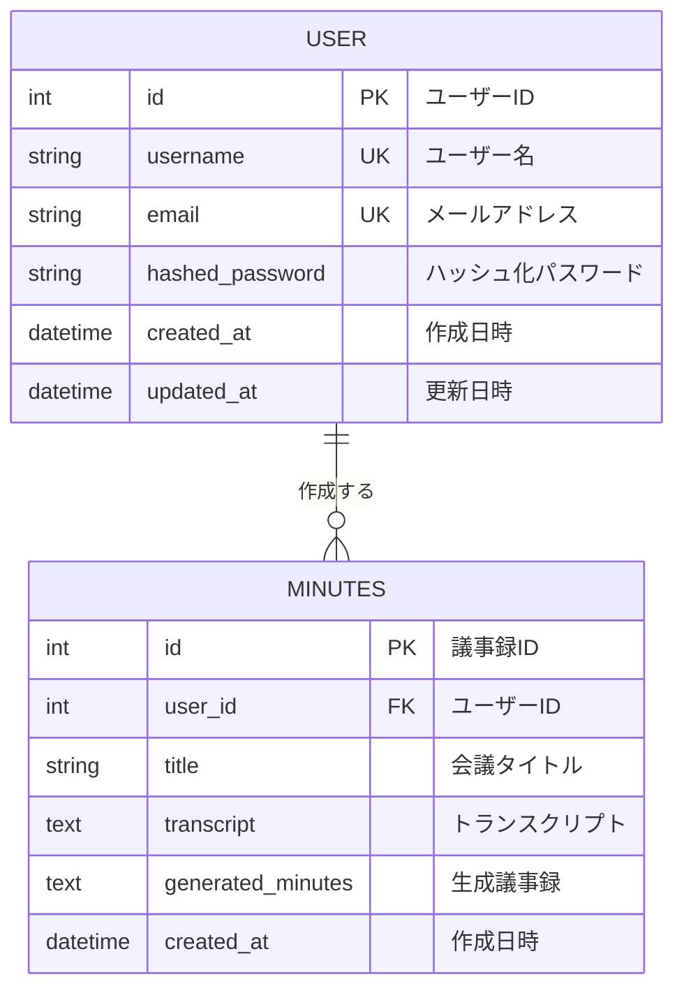

### 3.2 エンティティ概要

#### User（ユーザー）
- **説明**: システムを利用するユーザーの情報
- **主要属性**: ユーザー名、メールアドレス、パスワード
- **ビジネスルール**: 
  - ユーザー名とメールアドレスは一意
  - パスワードはハッシュ化して保存

#### Minutes（議事録）
- **説明**: 生成された議事録の情報
- **主要属性**: タイトル、トランスクリプト、生成議事録
- **ビジネスルール**: 
  - 必ずユーザーに紐づく
  - トランスクリプトは必須

## 4. 論理レベルER図

### 4.1 詳細エンティティ関係

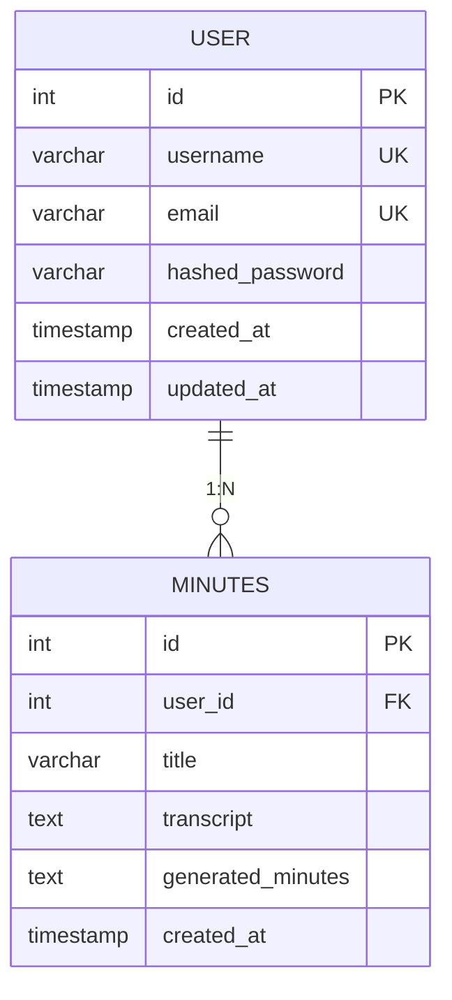

### 4.2 関係詳細

#### User - Minutes 関係
- **関係名**: "作成する" (creates)
- **カーディナリティ**: 1:N（一対多）
- **参加制約**: 
  - User側: オプション（ユーザーは議事録を持たなくても良い）
  - Minutes側: 必須（議事録は必ずユーザーに属する）
- **参照整合性**: CASCADE DELETE（ユーザー削除時に関連議事録も削除）

### 4.3 属性詳細

#### User エンティティ
| 属性名 | データ型 | 制約 | 説明 |
|--------|----------|------|------|
| id | INTEGER | PK, AUTO_INCREMENT | 主キー |
| username | VARCHAR(50) | NOT NULL, UNIQUE | ユーザー名 |
| email | VARCHAR(100) | NOT NULL, UNIQUE | メールアドレス |
| hashed_password | VARCHAR(255) | NOT NULL | ハッシュ化パスワード |
| created_at | TIMESTAMP | NOT NULL, DEFAULT NOW | 作成日時 |
| updated_at | TIMESTAMP | NOT NULL, DEFAULT NOW | 更新日時 |

#### Minutes エンティティ
| 属性名 | データ型 | 制約 | 説明 |
|--------|----------|------|------|
| id | INTEGER | PK, AUTO_INCREMENT | 主キー |
| user_id | INTEGER | FK, NOT NULL | 外部キー（User.id） |
| title | VARCHAR(200) | NULL | 会議タイトル |
| transcript | TEXT | NOT NULL | 元トランスクリプト |
| generated_minutes | TEXT | NOT NULL | 生成議事録 |
| created_at | TIMESTAMP | NOT NULL, DEFAULT NOW | 作成日時 |

## 5. 物理レベルER図

### 5.1 実装レベル関係図

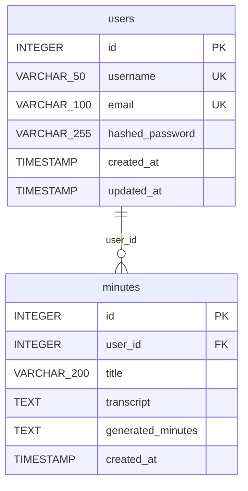

### 5.2 インデックス設計

#### Primary Key インデックス
```sql
-- 自動作成される主キーインデックス
CREATE UNIQUE INDEX pk_users ON users (id);
CREATE UNIQUE INDEX pk_minutes ON minutes (id);
```

#### Unique インデックス
```sql
-- ユーザー名一意インデックス
CREATE UNIQUE INDEX uk_users_username ON users (username);

-- メールアドレス一意インデックス
CREATE UNIQUE INDEX uk_users_email ON users (email);
```

#### Foreign Key インデックス
```sql
-- 外部キーインデックス
CREATE INDEX ix_minutes_user_id ON minutes (user_id);
```

#### 検索用インデックス
```sql
-- 複合インデックス（ユーザー別議事録検索用）
CREATE INDEX ix_minutes_user_created ON minutes (user_id, created_at DESC);

-- 日付インデックス
CREATE INDEX ix_minutes_created_at ON minutes (created_at DESC);
```

### 5.3 制約定義

#### 外部キー制約
```sql
ALTER TABLE minutes 
ADD CONSTRAINT fk_minutes_user_id 
FOREIGN KEY (user_id) REFERENCES users(id) 
ON DELETE CASCADE 
ON UPDATE CASCADE;
```

#### チェック制約
```sql
-- ユーザー名長さ制約
ALTER TABLE users ADD CONSTRAINT ck_users_username_length 
CHECK (LENGTH(username) >= 3 AND LENGTH(username) <= 50);

-- メールアドレス長さ制約
ALTER TABLE users ADD CONSTRAINT ck_users_email_length 
CHECK (LENGTH(email) <= 100);

-- トランスクリプト最小長制約
ALTER TABLE minutes ADD CONSTRAINT ck_minutes_transcript_length 
CHECK (LENGTH(transcript) >= 10);

-- タイトル長さ制約
ALTER TABLE minutes ADD CONSTRAINT ck_minutes_title_length 
CHECK (title IS NULL OR LENGTH(title) <= 200);
```

## 6. 拡張ER図

### 6.1 将来拡張を考慮したER図

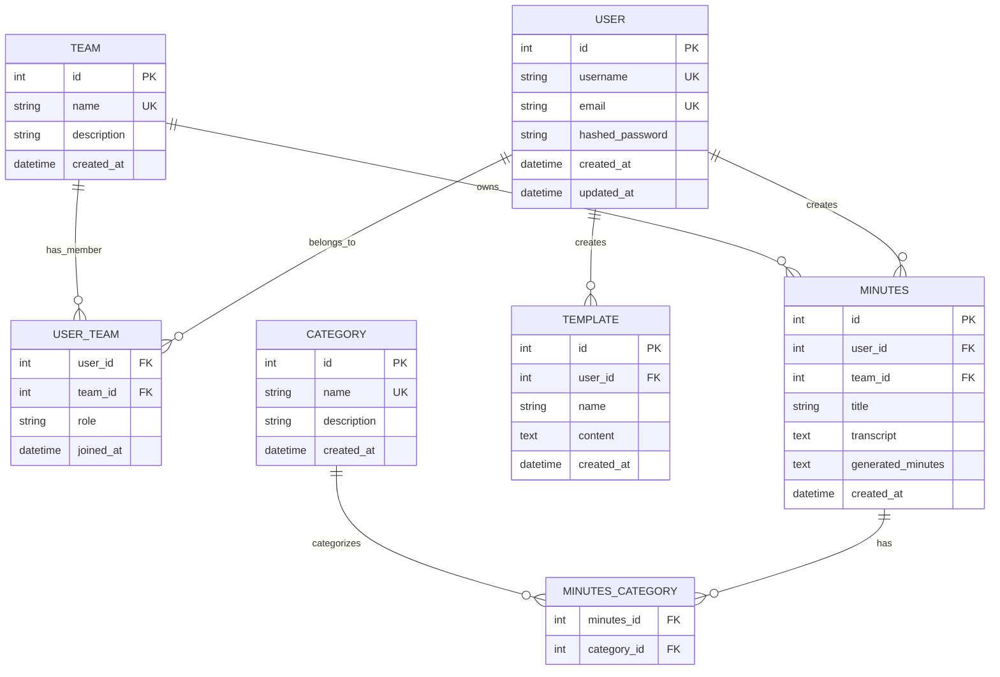

### 6.2 拡張エンティティ説明

#### Team（チーム）
- **目的**: チーム機能の実装
- **関係**: User との多対多関係（USER_TEAM経由）
- **属性**: チーム名、説明、作成日時

#### Template（テンプレート）
- **目的**: 議事録テンプレート機能
- **関係**: User との一対多関係
- **属性**: テンプレート名、内容、作成日時

#### Category（カテゴリ）
- **目的**: 議事録分類機能
- **関係**: Minutes との多対多関係（MINUTES_CATEGORY経由）
- **属性**: カテゴリ名、説明、作成日時

## 7. ビジネスルール図

### 7.1 制約関係図

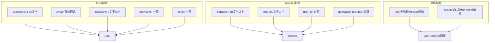

### 7.2 データフロー図

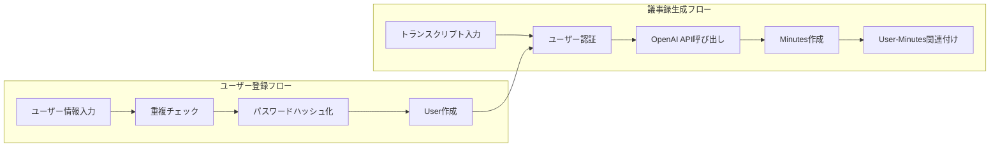

## 8. 正規化検証図

### 8.1 正規化プロセス

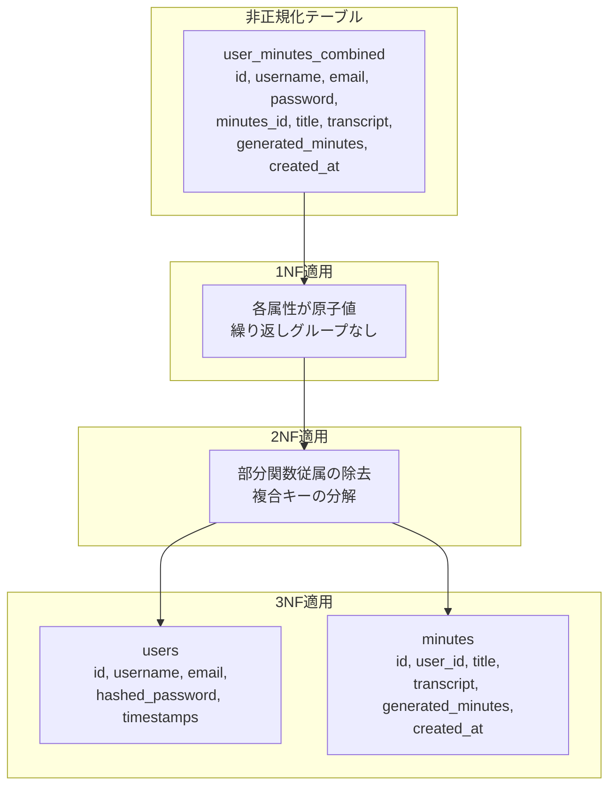

### 8.2 関数従属性図

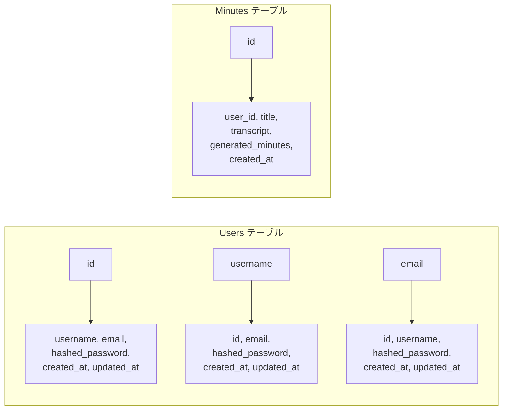

## 9. パフォーマンス考慮図

### 9.1 インデックス効果図

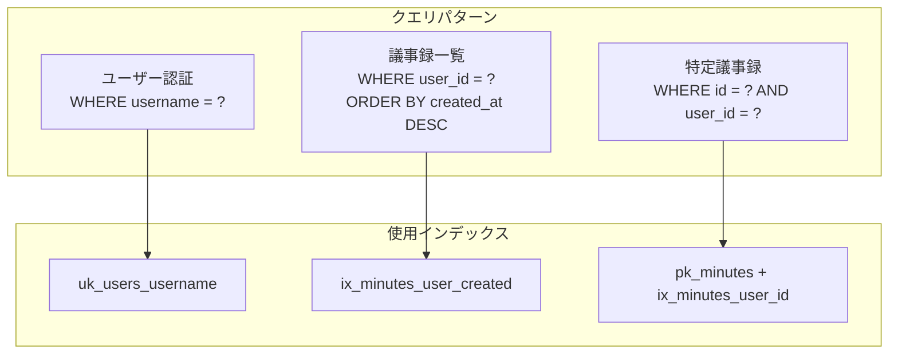

### 9.2 データアクセスパターン

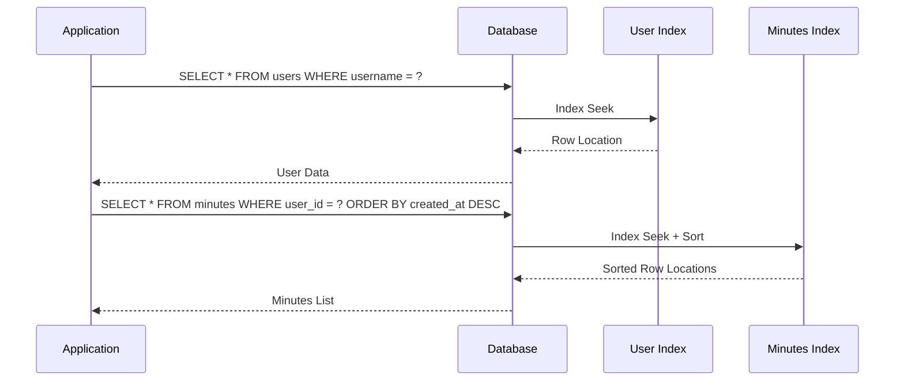

## 10. 実装マッピング

### 10.1 SQLAlchemy マッピング図

```mermaid
classDiagram
    class User {
        +Integer id
        +String username
        +String email
        +String hashed_password
        +DateTime created_at
        +DateTime updated_at
        +relationship minutes
    }
    
    class Minutes {
        +Integer id
        +Integer user_id
        +String title
        +Text transcript
        +Text generated_minutes
        +DateTime created_at
        +relationship user
    }
    
    User ||--o{ Minutes : "one-to-many"
```

### 10.2 API エンドポイントマッピング

```mermaid
graph LR
    subgraph "User関連API"
        A1[POST /auth/register] --> User
        A2[POST /auth/login] --> User
        A3[GET /users/profile] --> User
        A4[PUT /users/profile] --> User
    end
    
    subgraph "Minutes関連API"
        B1[POST /minutes/generate] --> Minutes
        B2[GET /minutes/history] --> Minutes
        B3[GET /minutes/{id}] --> Minutes
    end
    
    subgraph "データベース"
        User[users テーブル]
        Minutes[minutes テーブル]
    end
    
    User --> Minutes
```

## 11. 制約検証図

### 11.1 整合性制約チェック

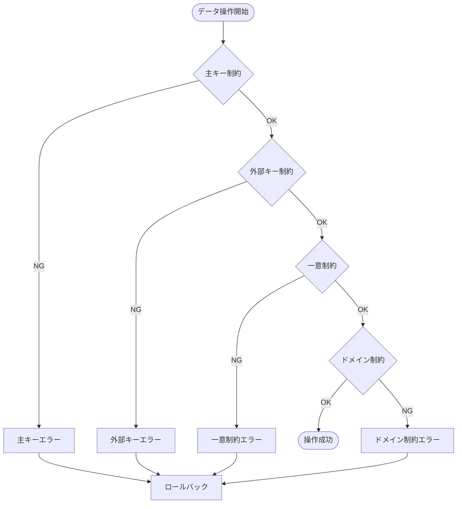

### 11.2 トランザクション境界

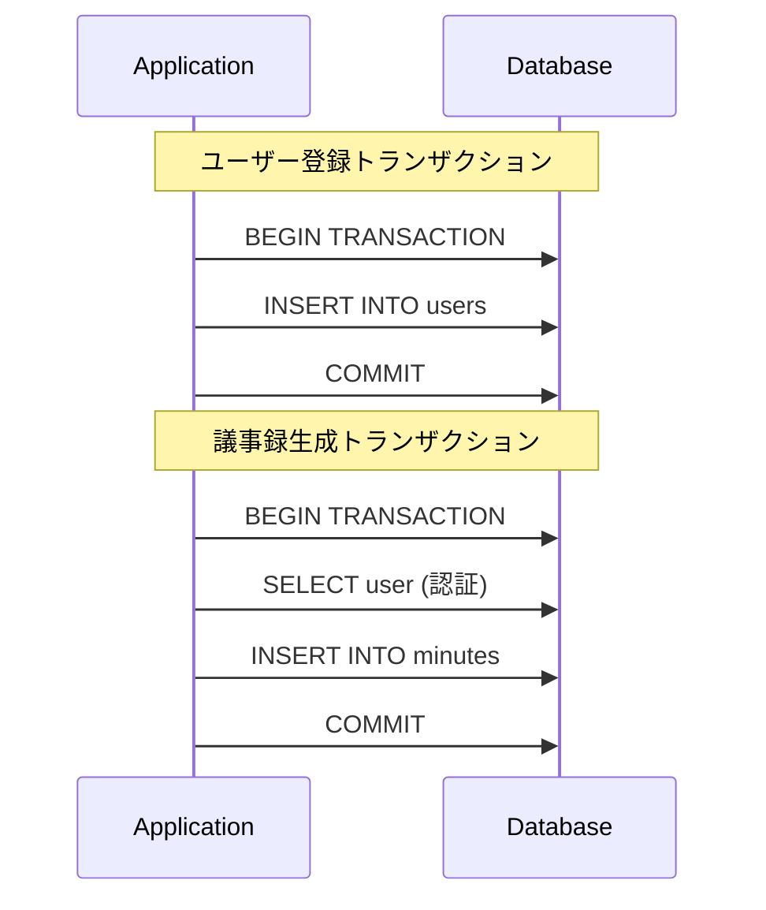

## 12. 運用考慮事項

### 12.1 バックアップ対象

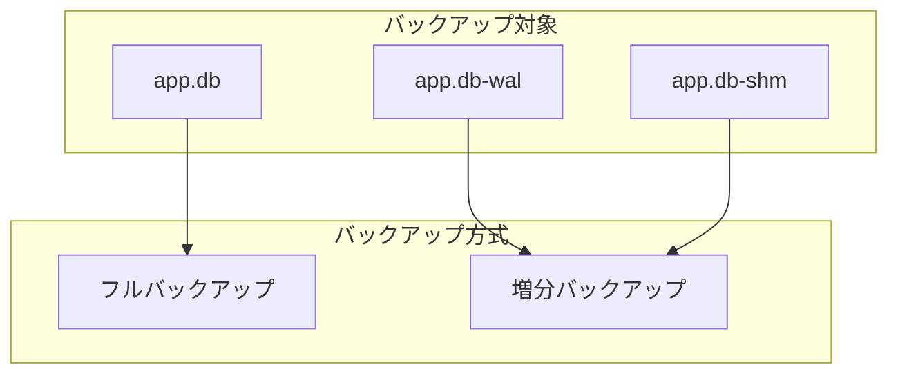

### 12.2 監視ポイント

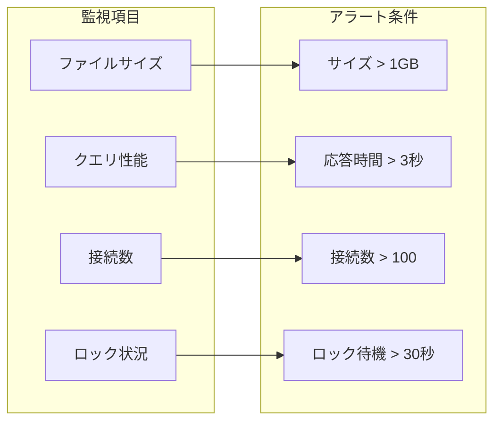

## 13. テスト観点

### 13.1 データ整合性テスト

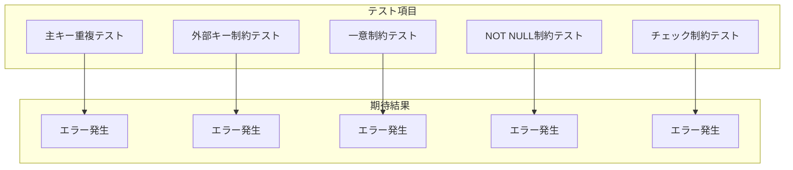

### 13.2 パフォーマンステスト

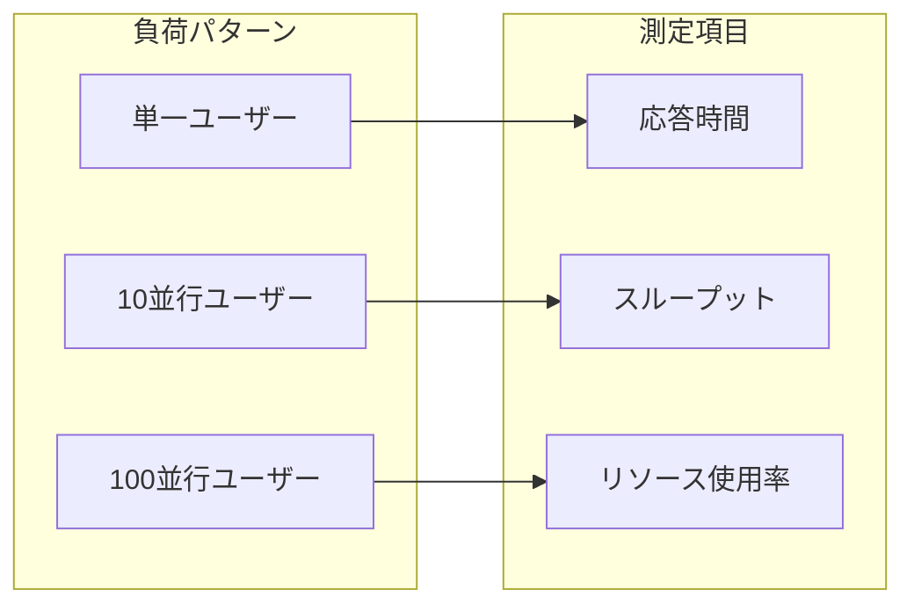

---

**作成日**: 2025年6月23日  
**作成者**: Devin AI  
**バージョン**: 1.0  
**承認者**: 未承認
