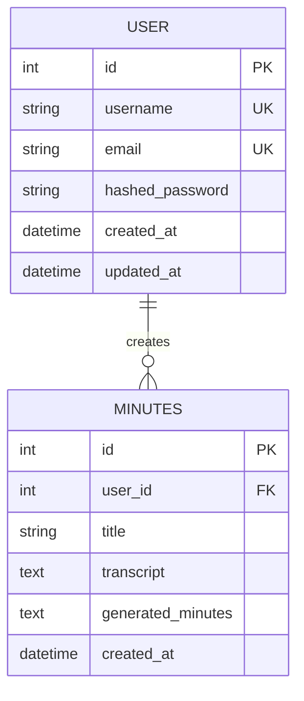
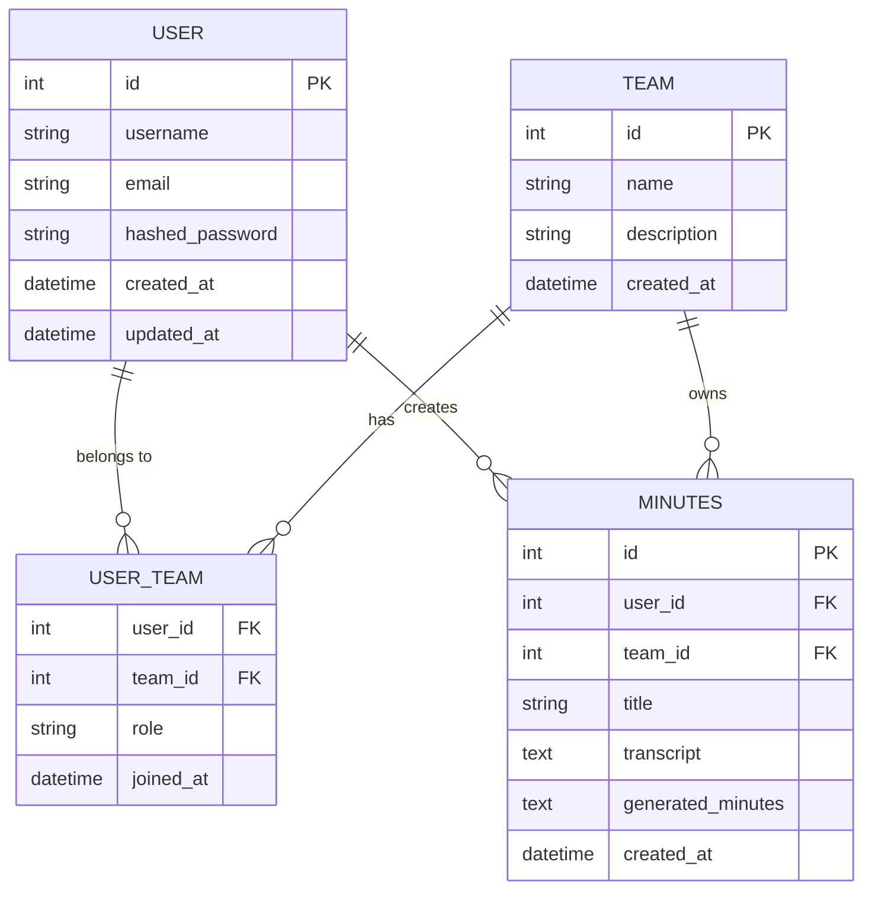

# データベース論理設計書

## 1. 概要

### 目的
トランスクリプトから議事録作成APIシステムのデータベース論理設計を詳細に定義し、エンティティ関係とデータ構造を明確化する

### 対象範囲
- エンティティ関係図（ER図）
- 論理データモデル
- 正規化設計
- データ整合性制約

### 前提条件
- リレーショナルデータベースモデルの使用
- 第3正規形までの正規化
- 参照整合性の確保

## 2. 設計方針

### 基本方針
- **正規化**: 第3正規形までの正規化によるデータ重複排除
- **整合性**: 参照整合性制約による一貫性確保
- **拡張性**: 将来的な機能追加に対応可能な設計
- **パフォーマンス**: 効率的なクエリ実行を考慮した設計

### 制約事項
- SQLite データベースの機能制限
- 外部キー制約の適切な設定
- データ型の制限

### 品質要件
- **一貫性**: データの整合性確保
- **可用性**: 効率的なデータアクセス
- **保守性**: 理解しやすいデータ構造

## 3. エンティティ関係図

### 3.1 概念レベルER図



### 3.2 詳細エンティティ関係

#### エンティティ間の関係
- **User - Minutes**: 1対多の関係
  - 1人のユーザーは複数の議事録を作成可能
  - 1つの議事録は1人のユーザーに属する
  - 参照整合性制約により、ユーザー削除時の議事録の扱いを定義

#### カーディナリティ
- User : Minutes = 1 : N
- 必須関係: Minutes は必ず User に属する
- オプション関係: User は議事録を持たなくても良い

## 4. エンティティ詳細設計

### 4.1 User エンティティ

#### 属性定義
| 属性名 | データ型 | 制約 | 説明 |
|--------|----------|------|------|
| id | INTEGER | PK, AUTO_INCREMENT | ユーザーID（主キー） |
| username | VARCHAR(50) | NOT NULL, UNIQUE | ユーザー名（一意制約） |
| email | VARCHAR(100) | NOT NULL, UNIQUE | メールアドレス（一意制約） |
| hashed_password | VARCHAR(255) | NOT NULL | ハッシュ化されたパスワード |
| created_at | TIMESTAMP | NOT NULL, DEFAULT CURRENT_TIMESTAMP | 作成日時 |
| updated_at | TIMESTAMP | NOT NULL, DEFAULT CURRENT_TIMESTAMP ON UPDATE | 更新日時 |

#### 制約条件
```sql
-- 主キー制約
CONSTRAINT pk_users PRIMARY KEY (id)

-- 一意制約
CONSTRAINT uk_users_username UNIQUE (username)
CONSTRAINT uk_users_email UNIQUE (email)

-- NOT NULL制約
CONSTRAINT nn_users_username CHECK (username IS NOT NULL)
CONSTRAINT nn_users_email CHECK (email IS NOT NULL)
CONSTRAINT nn_users_hashed_password CHECK (hashed_password IS NOT NULL)

-- 長さ制約
CONSTRAINT ck_users_username_length CHECK (LENGTH(username) >= 3 AND LENGTH(username) <= 50)
CONSTRAINT ck_users_email_length CHECK (LENGTH(email) <= 100)

-- フォーマット制約
CONSTRAINT ck_users_username_format CHECK (username REGEXP '^[a-zA-Z0-9_-]+$')
CONSTRAINT ck_users_email_format CHECK (email LIKE '%@%.%')
```

#### ビジネスルール
- **ユーザー名**: 3-50文字、英数字・アンダースコア・ハイフンのみ
- **メールアドレス**: 有効なメールアドレス形式、最大100文字
- **パスワード**: bcryptでハッシュ化、元のパスワードは8文字以上
- **作成日時**: ユーザー登録時に自動設定
- **更新日時**: プロフィール更新時に自動更新

### 4.2 Minutes エンティティ

#### 属性定義
| 属性名 | データ型 | 制約 | 説明 |
|--------|----------|------|------|
| id | INTEGER | PK, AUTO_INCREMENT | 議事録ID（主キー） |
| user_id | INTEGER | NOT NULL, FK | ユーザーID（外部キー） |
| title | VARCHAR(200) | NULL | 会議タイトル（オプション） |
| transcript | TEXT | NOT NULL | 元のトランスクリプト |
| generated_minutes | TEXT | NOT NULL | 生成された議事録 |
| created_at | TIMESTAMP | NOT NULL, DEFAULT CURRENT_TIMESTAMP | 作成日時 |

#### 制約条件
```sql
-- 主キー制約
CONSTRAINT pk_minutes PRIMARY KEY (id)

-- 外部キー制約
CONSTRAINT fk_minutes_user_id FOREIGN KEY (user_id) REFERENCES users(id) ON DELETE CASCADE

-- NOT NULL制約
CONSTRAINT nn_minutes_user_id CHECK (user_id IS NOT NULL)
CONSTRAINT nn_minutes_transcript CHECK (transcript IS NOT NULL)
CONSTRAINT nn_minutes_generated_minutes CHECK (generated_minutes IS NOT NULL)

-- 長さ制約
CONSTRAINT ck_minutes_title_length CHECK (title IS NULL OR LENGTH(title) <= 200)
CONSTRAINT ck_minutes_transcript_length CHECK (LENGTH(transcript) >= 10)

-- 内容制約
CONSTRAINT ck_minutes_transcript_not_empty CHECK (TRIM(transcript) != '')
CONSTRAINT ck_minutes_generated_minutes_not_empty CHECK (TRIM(generated_minutes) != '')
```

#### ビジネスルール
- **ユーザーID**: 必須、Users テーブルへの参照
- **タイトル**: オプション、最大200文字
- **トランスクリプト**: 必須、最小10文字、空白のみ不可
- **生成議事録**: 必須、OpenAI APIで生成された内容
- **作成日時**: 議事録生成時に自動設定

## 5. 正規化設計

### 5.1 正規化プロセス

#### 第1正規形（1NF）
- **原子性**: 各属性は原子値のみを持つ
- **一意性**: 各行は一意に識別可能
- **順序性**: 行と列の順序に意味を持たない

```sql
-- 1NF適用例
-- ❌ 非正規化（複数値属性）
CREATE TABLE users_bad (
    id INTEGER,
    username VARCHAR(50),
    emails TEXT  -- "email1,email2,email3" のような複数値
);

-- ✅ 1NF適用
CREATE TABLE users (
    id INTEGER PRIMARY KEY,
    username VARCHAR(50),
    email VARCHAR(100)  -- 単一値
);
```

#### 第2正規形（2NF）
- **1NF**: 第1正規形を満たす
- **完全関数従属**: 非キー属性は主キー全体に完全関数従属

```sql
-- 現在の設計は既に2NFを満たしている
-- 各テーブルの主キーは単一属性（id）のため、部分関数従属は発生しない
```

#### 第3正規形（3NF）
- **2NF**: 第2正規形を満たす
- **推移関数従属の排除**: 非キー属性間の推移的依存を排除

```sql
-- 現在の設計は3NFを満たしている
-- 例: Minutes テーブルで user_id → username のような推移的依存は存在しない
-- ユーザー情報が必要な場合は JOIN を使用
```

### 5.2 正規化の検証

#### Users テーブルの正規化検証
```
関数従属性:
- id → username, email, hashed_password, created_at, updated_at
- username → id, email, hashed_password, created_at, updated_at
- email → id, username, hashed_password, created_at, updated_at

候補キー: {id}, {username}, {email}
主キー: {id}

3NF検証: ✅
- 全ての非キー属性は主キーに完全関数従属
- 推移的依存は存在しない
```

#### Minutes テーブルの正規化検証
```
関数従属性:
- id → user_id, title, transcript, generated_minutes, created_at
- (user_id, created_at) → id (複合候補キー候補だが、idで十分)

候補キー: {id}
主キー: {id}

3NF検証: ✅
- 全ての非キー属性は主キーに完全関数従属
- user_id は外部キーであり、推移的依存ではない
```

## 6. データ整合性制約

### 6.1 エンティティ整合性

#### 主キー制約
```sql
-- Users テーブル
ALTER TABLE users ADD CONSTRAINT pk_users PRIMARY KEY (id);

-- Minutes テーブル
ALTER TABLE minutes ADD CONSTRAINT pk_minutes PRIMARY KEY (id);
```

#### 一意制約
```sql
-- Users テーブルの一意制約
ALTER TABLE users ADD CONSTRAINT uk_users_username UNIQUE (username);
ALTER TABLE users ADD CONSTRAINT uk_users_email UNIQUE (email);
```

### 6.2 参照整合性

#### 外部キー制約
```sql
-- Minutes テーブルの外部キー制約
ALTER TABLE minutes 
ADD CONSTRAINT fk_minutes_user_id 
FOREIGN KEY (user_id) REFERENCES users(id) 
ON DELETE CASCADE 
ON UPDATE CASCADE;
```

#### 参照整合性ルール
- **ON DELETE CASCADE**: ユーザー削除時、関連する議事録も削除
- **ON UPDATE CASCADE**: ユーザーID更新時、関連する議事録のuser_idも更新

### 6.3 ドメイン整合性

#### チェック制約
```sql
-- Users テーブルのチェック制約
ALTER TABLE users ADD CONSTRAINT ck_users_username_length 
CHECK (LENGTH(username) >= 3 AND LENGTH(username) <= 50);

ALTER TABLE users ADD CONSTRAINT ck_users_email_length 
CHECK (LENGTH(email) <= 100);

ALTER TABLE users ADD CONSTRAINT ck_users_username_format 
CHECK (username REGEXP '^[a-zA-Z0-9_-]+$');

-- Minutes テーブルのチェック制約
ALTER TABLE minutes ADD CONSTRAINT ck_minutes_title_length 
CHECK (title IS NULL OR LENGTH(title) <= 200);

ALTER TABLE minutes ADD CONSTRAINT ck_minutes_transcript_length 
CHECK (LENGTH(transcript) >= 10);

ALTER TABLE minutes ADD CONSTRAINT ck_minutes_transcript_not_empty 
CHECK (TRIM(transcript) != '');
```

## 7. データ辞書

### 7.1 Users テーブル

| 項目 | 内容 |
|------|------|
| テーブル名 | users |
| 論理名 | ユーザー |
| 説明 | システムを利用するユーザーの情報を管理 |
| 主キー | id |
| 外部キー | なし |
| インデックス | username, email |

#### 属性詳細
| 属性名 | 論理名 | データ型 | 長さ | NULL | デフォルト | 説明 |
|--------|--------|----------|------|------|-----------|------|
| id | ユーザーID | INTEGER | - | NO | AUTO_INCREMENT | 一意識別子 |
| username | ユーザー名 | VARCHAR | 50 | NO | - | ログイン用ユーザー名 |
| email | メールアドレス | VARCHAR | 100 | NO | - | 連絡先メールアドレス |
| hashed_password | ハッシュ化パスワード | VARCHAR | 255 | NO | - | bcryptでハッシュ化されたパスワード |
| created_at | 作成日時 | TIMESTAMP | - | NO | CURRENT_TIMESTAMP | レコード作成日時 |
| updated_at | 更新日時 | TIMESTAMP | - | NO | CURRENT_TIMESTAMP | レコード最終更新日時 |

### 7.2 Minutes テーブル

| 項目 | 内容 |
|------|------|
| テーブル名 | minutes |
| 論理名 | 議事録 |
| 説明 | 生成された議事録の情報を管理 |
| 主キー | id |
| 外部キー | user_id → users(id) |
| インデックス | user_id, created_at |

#### 属性詳細
| 属性名 | 論理名 | データ型 | 長さ | NULL | デフォルト | 説明 |
|--------|--------|----------|------|------|-----------|------|
| id | 議事録ID | INTEGER | - | NO | AUTO_INCREMENT | 一意識別子 |
| user_id | ユーザーID | INTEGER | - | NO | - | 作成者のユーザーID |
| title | 会議タイトル | VARCHAR | 200 | YES | NULL | 会議のタイトル（オプション） |
| transcript | トランスクリプト | TEXT | - | NO | - | 元の会議トランスクリプト |
| generated_minutes | 生成議事録 | TEXT | - | NO | - | AIで生成された議事録 |
| created_at | 作成日時 | TIMESTAMP | - | NO | CURRENT_TIMESTAMP | レコード作成日時 |

## 8. ビジネスルール

### 8.1 ユーザー管理ルール

#### 登録ルール
- ユーザー名は3-50文字の英数字、アンダースコア、ハイフンのみ
- メールアドレスは有効な形式で最大100文字
- パスワードは8文字以上（ハッシュ化して保存）
- ユーザー名とメールアドレスは一意である必要がある

#### 更新ルール
- ユーザー名とメールアドレスは変更可能
- 変更時も一意制約を満たす必要がある
- パスワード変更は別途専用エンドポイントで実施

#### 削除ルール
- ユーザー削除時は関連する議事録も削除（CASCADE）
- 論理削除ではなく物理削除を実施

### 8.2 議事録管理ルール

#### 作成ルール
- 議事録は必ずユーザーに紐づく
- トランスクリプトは10文字以上必須
- タイトルはオプション（最大200文字）
- 生成議事録は空文字列不可

#### アクセスルール
- ユーザーは自分が作成した議事録のみアクセス可能
- 他のユーザーの議事録は参照・更新・削除不可

#### 保持ルール
- 議事録に保持期限は設定しない
- ユーザーが削除されない限り永続保存

## 9. データ品質管理

### 9.1 データ検証

#### 入力時検証
```sql
-- ユーザー名フォーマット検証
CREATE TRIGGER tr_users_username_validation
BEFORE INSERT OR UPDATE ON users
FOR EACH ROW
BEGIN
    IF NEW.username NOT REGEXP '^[a-zA-Z0-9_-]+$' THEN
        SIGNAL SQLSTATE '45000' SET MESSAGE_TEXT = 'Invalid username format';
    END IF;
END;

-- メールアドレス検証
CREATE TRIGGER tr_users_email_validation
BEFORE INSERT OR UPDATE ON users
FOR EACH ROW
BEGIN
    IF NEW.email NOT LIKE '%@%.%' THEN
        SIGNAL SQLSTATE '45000' SET MESSAGE_TEXT = 'Invalid email format';
    END IF;
END;
```

#### データ整合性チェック
```sql
-- 議事録の内容検証
CREATE TRIGGER tr_minutes_content_validation
BEFORE INSERT OR UPDATE ON minutes
FOR EACH ROW
BEGIN
    IF LENGTH(TRIM(NEW.transcript)) < 10 THEN
        SIGNAL SQLSTATE '45000' SET MESSAGE_TEXT = 'Transcript too short';
    END IF;
    
    IF TRIM(NEW.generated_minutes) = '' THEN
        SIGNAL SQLSTATE '45000' SET MESSAGE_TEXT = 'Generated minutes cannot be empty';
    END IF;
END;
```

### 9.2 データクレンジング

#### 定期的なデータ検証
```sql
-- 孤立レコードの検出
SELECT m.id, m.user_id 
FROM minutes m 
LEFT JOIN users u ON m.user_id = u.id 
WHERE u.id IS NULL;

-- 重複データの検出
SELECT username, email, COUNT(*) 
FROM users 
GROUP BY username, email 
HAVING COUNT(*) > 1;
```

## 10. 将来拡張への考慮

### 10.1 拡張可能性

#### 追加予定エンティティ
- **Teams**: チーム機能
- **Permissions**: 権限管理
- **Templates**: 議事録テンプレート
- **Categories**: 議事録カテゴリ

#### 拡張時の影響分析


### 10.2 マイグレーション計画

#### 段階的拡張アプローチ
1. **Phase 1**: 現在の設計（User, Minutes）
2. **Phase 2**: チーム機能追加（Team, UserTeam）
3. **Phase 3**: 権限管理追加（Permission, Role）
4. **Phase 4**: テンプレート機能追加（Template, Category）

## 11. 実装考慮事項

### 11.1 開発時の注意点
- **外部キー制約**: SQLiteでの外部キー制約有効化
- **トランザクション**: データ整合性確保のための適切なトランザクション管理
- **インデックス**: パフォーマンス向上のための適切なインデックス設計
- **バックアップ**: 定期的なデータバックアップの実施

### 11.2 既知の課題
- SQLiteの同時書き込み制限
- 大容量テキストデータの処理
- 複雑なクエリのパフォーマンス

### 11.3 代替案
- **PostgreSQL**: より高機能なデータベースへの移行
- **NoSQL**: ドキュメント指向データベースの検討
- **分散DB**: スケーラビリティ向上のための分散データベース

## 12. テスト観点

### 12.1 データ整合性テスト
- 主キー制約の確認
- 外部キー制約の確認
- 一意制約の確認
- チェック制約の確認

### 12.2 ビジネスルールテスト
- ユーザー登録ルールの確認
- 議事録作成ルールの確認
- アクセス権限ルールの確認

### 12.3 パフォーマンステスト
- 大量データでのクエリ性能確認
- インデックス効果の確認
- 同時アクセス時の動作確認

## 13. 運用考慮事項

### 13.1 データ監視
- データ増加率の監視
- データ品質の定期チェック
- パフォーマンス指標の監視

### 13.2 保守作業
- 定期的なデータバックアップ
- インデックスの最適化
- 統計情報の更新

---

**作成日**: 2025年6月23日  
**作成者**: Devin AI  
**バージョン**: 1.0  
**承認者**: 未承認
